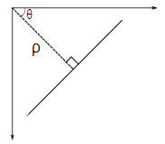

# 霍夫线变换

## 目标

在这一章当中，

*   我们将理解霍夫变换的概念。
*   我们将看到如何使用它来检测图像中的线条。
*   我们将了解以下函数： **[cv.HoughLines（）](../../dd/d1a/group__imgproc__feature.html#ga46b4e588934f6c8dfd509cc6e0e4545a "Finds lines in a binary image using the standard Hough transform. ")** ， **[cv.HoughLinesP（）](../../dd/d1a/group__imgproc__feature.html#ga8618180a5948286384e3b7ca02f6feeb "Finds line segments in a binary image using the probabilistic Hough transform. ")**

## 理论

如果您能够以数学形式表示该形状，则霍夫变换是一种用于检测任何形状的流行技术。它可以检测到形状，即使它被破坏或扭曲一点点。我们将看到它如何适用于生产线。

一条线可以表示为$y = mx+c$或以极坐标形式 $\rho = x \cos \theta + y \sin \theta$表示为其中$\rho$是垂线从原点到直线的距离。$\theta$是这条垂直线形成的角度，水平轴是逆时针测量的（该方向因你代表坐标系而变化。这种表示用于 OpenCV ）。检查下图：



所以如果这条线经过原点以下，它会有一个小于 180 度的正角度。如果它在原点上方，我们不是取一个大于 180 的角，而是取一个小于 180 的负角度。任何垂直线都是 0 度，水平线是 90 度。

现在我们来看看霍夫变换是怎么作用于直线的。任何线都可以被表示成这两项<a href="https://www.codecogs.com/eqnedit.php?latex=\left&space;(\rho,\theta&space;\right&space;)" target="_blank"></a>。所以首先它创建了一个二维数组，或者是累加器(来保存这两个参数的值)然后他设置<a href="https://www.codecogs.com/eqnedit.php?latex=\theta" target="_blank"></a>作为初始值。 令(二维数组的)行表示<a href="https://www.codecogs.com/eqnedit.php?latex=\rho" target="_blank"></a>，令列表示 <a href="https://www.codecogs.com/eqnedit.php?latex=\theta" target="_blank"></a>。数组的大小取决于你需要的精准度。假设说你想要角度的精度是精确到 1 度，那你就需要 180 列。而对于<a href="https://www.codecogs.com/eqnedit.php?latex=\rho" target="_blank"></a>来说，最大可能的距离是图像的对角线长度。因此，要精确到一个像素的程度，行数应该是图像的对角长度。

想象有一张 100x100 的图像，它上面有一条水平的线条在图像正中间。取这条线的第一个点，你知道它的坐标 (x,y)值。现在，按照这条直线的等式，把值<a href="https://www.codecogs.com/eqnedit.php?latex=\theta&space;=&space;0,1,2,&space;...&space;,180" target="_blank"></a>带入，并且查看你获取到的<a href="https://www.codecogs.com/eqnedit.php?latex=\rho" target="_blank"></a>值。对每一对<a href="https://www.codecogs.com/eqnedit.php?latex=\left&space;(\rho,\theta&space;\right&space;)" target="_blank"></a>，我们都把它们在累加器中对应的值计数增加 1。而此时，在这个计数器中，单元 (50,90) 和其他单元一样计数等于 1。

现在去这条线上的第二个点，重复上面的步骤。增加单元中你拿到的对应的值(rho, theta)。这一次，单元(50,90)的计数增到到了 2。你实际上做的是投票投出<a href="https://www.codecogs.com/eqnedit.php?latex=\left&space;(\rho,\theta&space;\right&space;)" target="_blank"></a>值。你不断为这条直线上所有的点继续这个过程。在每一个点，单元(50,90)都会得票，而其他的单元有可能会得票，也有可能不会。按这个方案，最终单元 (50,90) 会获得最高的投票(译者注：在 100X100 的图像正中水平的直线到原点距离为 50，垂角 90 度)。所以最终搜索我们的累加器来找最高得票的单元，我们就会取到 (50,90)，这就说明图像中有一条线距离原点垂距 50，它过原点的垂线和水平线夹角为 90 度。这个过程很好的显示在了以下的动画中。（图片提供： [Amos Storkey](http://homepages.inf.ed.ac.uk/amos/hough.html) ）


这就是霍夫变化针对直线工作的原理。非常简单，也许你可以用 Numpy 自己来实现它。以下是一张显示了累加器的图像。在某些地方的亮点说明它们是图像中可能线条的参数。（图片提供：[维基百科](http://en.wikipedia.org/wiki/Hough_transform)）


# OpenCV 中的霍夫变换

上面解释的这一堆东西，在 OpenCV 里都封装起来成为**[cv.HoughLines（）](../../dd/d1a/group__imgproc__feature.html#ga46b4e588934f6c8dfd509cc6e0e4545a "Finds lines in a binary image using the standard Hough transform. ")** 函数了。它简单的返回了一个:math:(rho, theta)`值得数组。$\rho$ 的单位是像素，$\theta$的单位是弧度。第一个参数，输入图像应该是个二元图像，所以在应用霍夫线性变换之前先来个阈值法或者坎尼边缘检测。第二、第三参数分别是 $\rho$ 和 $\theta$ 的精度。第四个参数则是一个阈值，它代表了一个$(\rho,\theta)$单元被认为是一条直线需要获得的最低票数。要记住的是，得票数其实取决于这条直线穿过了多少个点。所以它也代表了应被检测出的线条最少有多长。

```python
import cv2 as cv
import numpy as np
img = cv.imread(cv.samples.findFile('sudoku.png'))
gray = cv.cvtColor(img,cv.COLOR_BGR2GRAY)
edges = cv.Canny(gray,50,150,apertureSize = 3)
lines = cv.HoughLines(edges,1,np.pi/180,200)
for line in lines:
    rho,theta = line[0]
    a = np.cos(theta)
    b = np.sin(theta)
    x0 = a*rho
    y0 = b*rho
    x1 = int(x0 + 1000*(-b))
    y1 = int(y0 + 1000*(a))
    x2 = int(x0 - 1000*(-b))
    y2 = int(y0 - 1000*(a))
    cv.line(img,(x1,y1),(x2,y2),(0,0,255),2)
cv.imwrite('houghlines3.jpg',img)
```

检查以下结果：


## 概率 Hough 变换

在霍夫变换中，你可以发现即使是一条仅有两个参数的直线，也需要用到大量的计算。概率霍夫变换是我们已知的，针对霍夫变换的优化方案。它不去取所有的点来列入考虑，取而代之的是取足够完成直线检测的这些点的随机子集。只要我们把阈值下调一点。下图在霍夫空间中比较了霍夫变换与概率霍夫变换。（图片提供： [Franck Bettinger 的主页](http://phdfb1.free.fr/robot/mscthesis/node14.html)）


OpenCV 实现基于使用 Matas，J。和 Galambos，C。和 Kittler，J.V。 [[133]](../../d0/de3/citelist.html#CITEREF_Matas00) 的渐进概率 Hough 变换的线的鲁棒检测。使用的函数是 **[cv.HoughLinesP（）](../../dd/d1a/group__imgproc__feature.html#ga8618180a5948286384e3b7ca02f6feeb "Finds line segments in a binary image using the probabilistic Hough transform. ")** 。它比之前介绍的函数多出来两个参数：

*   **minLineLength** - 最小线长。比这个值小的线条会被丢弃。
*   **maxLineGap** - 允许线段之间的最大间隙，以便将(在同一条直线上的)线段视为同一条。

最好的是，它直接返回直线的两个端点。在前面的例子中，你只得到直线的参数，你必须找到所有的点。而这个方法，一切都是那么的直接和简单。

```python
import cv2 as cv
import numpy as np
img = cv.imread(cv.samples.findFile('sudoku.png'))
gray = cv.cvtColor(img,cv.COLOR_BGR2GRAY)
edges = cv.Canny(gray,50,150,apertureSize = 3)
lines = cv.HoughLinesP(edges,1,np.pi/180,100,minLineLength=100,maxLineGap=10)
for line in lines:
    x1,y1,x2,y2 = line[0]
    cv.line(img,(x1,y1),(x2,y2),(0,255,0),2)
cv.imwrite('houghlines5.jpg',img)
```

请参阅以下结果：


## 其他资源

1.  [维基百科的 Hough 变换](http://en.wikipedia.org/wiki/Hough_transform)

## 练习
