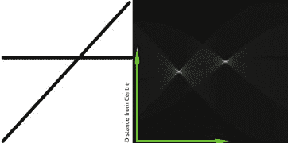
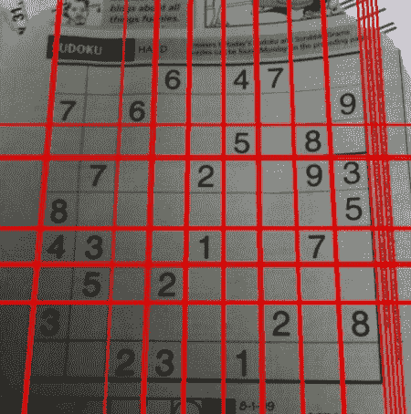
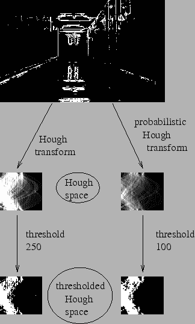
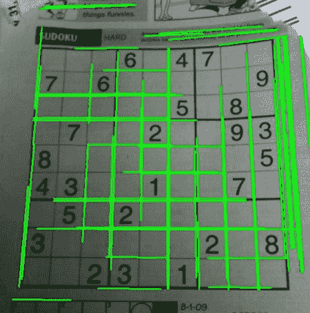

# 霍夫线变换

## 目标

在这一章当中，

*   我们将理解霍夫变换的概念。
*   我们将看到如何使用它来检测图像中的线条。
*   我们将看到以下功能： **[cv.HoughLines（）](../../dd/d1a/group__imgproc__feature.html#ga46b4e588934f6c8dfd509cc6e0e4545a "Finds lines in a binary image using the standard Hough transform. ")** ， **[cv.HoughLinesP（）](../../dd/d1a/group__imgproc__feature.html#ga8618180a5948286384e3b7ca02f6feeb "Finds line segments in a binary image using the probabilistic Hough transform. ")**

## 理论

如果您能够以数学形式表示该形状，则霍夫变换是一种用于检测任何形状的流行技术。它可以检测到形状，即使它被破坏或扭曲一点点。我们将看到它如何适用于生产线。

一条线可以表示为\（y = mx + c \）或以参数形式表示为\（\ rho = x \ cos \ theta + y \ sin \ theta \）其中\（\ rho \）是垂线从原点到直线的距离，\（\ theta \）是这条垂直线形成的角度，水平轴是逆时针测量的（该方向因你代表坐标系而变化。这种表示用于OpenCV ）。检查下图：

<object data="../../houghlines1.svg" type="image/svg+xml">houghlines1.svg</object>image

因此，如果线在原点以下通过，它将具有正rho和小于180的角度。如果它超过原点，而不是采用大于180的角度，则角度小于180，并且rho被认为是否定的。任何垂直线都有0度，水平线有90度。

现在让我们看看霍夫变换如何为线条工作。任何行都可以用这两个术语表示，\（（\ rho，\ theta）\）。首先，它创建一个2D数组或累加器（以保存两个参数的值），并且最初设置为0。让行表示\（\ rho \），列表示\（\ theta \）。阵列的大小取决于您需要的准确度。假设您希望角度精度为1度，则需要180列。对于\（\ rho \），可能的最大距离是图像的对角线长度。因此，取一个像素精度，行数可以是图像的对角线长度。

考虑一个100x100的图像，中间有一条水平线。取第一点。你知道它的（x，y）值。现在在线方程中，输入值\（\ theta = 0,1,2，....，180 \）并检查你得到的\（\ rho \）。对于每个\（（\ rho，\ theta）\）对，您在我们的累加器中将值增加1对应的\（（\ rho，\ theta）\）单元格。所以现在在累加器中，单元格（50,90）= 1以及其他一些单元格。

现在取第二点就行了。和上面一样。增加与您获得的`(rho, theta)`对应的单元格中的值。这一次，单元格（50,90）= 2.你实际做的是投票\（（\ rho，\ theta）\）值。您可以继续执行此过程中的每个点。在每个点，单元格（50,90）将递增或投票，而其他单元格可能会或可能不会被投票。这样，最后，单元格（50,90）将获得最大票数。因此，如果您搜索累加器以获得最大投票，则会得到值（50,90），该值表示此图像中距离原点和角度为90度的距离为50。在下面的动画中有很好的展示（图片提供： [Amos Storkey](http://homepages.inf.ed.ac.uk/amos/hough.html) ）


这就是霍夫变换对线条的作用。它很简单，也许您可​​以自己使用Numpy来实现它。下面是显示累加器的图像。某些位置的亮点表示它们是图像中可能线条的参数。 （图片提供：[维基百科](http://en.wikipedia.org/wiki/Hough_transform)）



# OpenCV中的霍夫变换

上面解释的所有内容都封装在OpenCV函数中， **[cv.HoughLines（）](../../dd/d1a/group__imgproc__feature.html#ga46b4e588934f6c8dfd509cc6e0e4545a "Finds lines in a binary image using the standard Hough transform. ")** 。它只返回一个数组：math：（rho，theta）`values。 \（\ rho \）以像素为单位测量，\（\ theta \）以弧度为单位。第一个参数，输入图像应该是二进制图像，因此在应用霍夫变换之前应用阈值或使用精确边缘检测。第二和第三个参数分别是\（\ rho \）和\（\ theta \）精度。第四个参数是阈值，这意味着它应该被视为一条线的最小投票。请记住，投票数取决于该线上的点数。因此它表示应检测的最小行长度。

```
import cv2 as cvimport numpy as npimg = cv.imread(cv.samples.findFile('sudoku.png'))gray = cv.cvtColor(img,cv.COLOR_BGR2GRAY)edges = cv.Canny(gray,50,150,apertureSize = 3)lines = cv.HoughLines(edges,1,np.pi/180,200)for line in lines:    rho,theta = line[0]    a = np.cos(theta)    b = np.sin(theta)    x0 = a*rho    y0 = b*rho    x1 = int(x0 + 1000*(-b))    y1 = int(y0 + 1000*(a))    x2 = int(x0 - 1000*(-b))    y2 = int(y0 - 1000*(a)) cv.line(img,(x1,y1),(x2,y2),(0,0,255),2)cv.imwrite('houghlines3.jpg',img)
```

检查以下结果：

image

## 概率Hough变换

在霍夫变换中，您可以看到即使对于具有两个参数的行，也需要大量计算。概率Hough变换是我们看到的Hough变换的优化。它没有考虑所有要点。相反，它只需要一个足以进行线检测的随机点子集。只是我们必须降低门槛。请参见下图，其中比较霍夫空间中的霍夫变换和概率霍夫变换。 （图片提供： [Franck Bettinger的主页](http://phdfb1.free.fr/robot/mscthesis/node14.html)）

image

OpenCV实现基于使用Matas，J。和Galambos，C。和Kittler，J.V。 [[133]](../../d0/de3/citelist.html#CITEREF_Matas00) 的渐进概率Hough变换的线的鲁棒检测。使用的函数是 **[cv.HoughLinesP（）](../../dd/d1a/group__imgproc__feature.html#ga8618180a5948286384e3b7ca02f6feeb "Finds line segments in a binary image using the probabilistic Hough transform. ")** 。它有两个新的论点。

*   **minLineLength** - 最小行长。短于此的线段被拒绝。
*   **maxLineGap** - 线段之间允许的最大间隙，将它们视为一条线。

最好的是，它直接返回行的两个端点。在前面的例子中，你只得到了行的参数，你必须找到所有的点。在这里，一切都是直接而简单的。

```
import cv2 as cvimport numpy as npimg = cv.imread(cv.samples.findFile('sudoku.png'))gray = cv.cvtColor(img,cv.COLOR_BGR2GRAY)edges = cv.Canny(gray,50,150,apertureSize = 3)lines = cv.HoughLinesP(edges,1,np.pi/180,100,minLineLength=100,maxLineGap=10)for line in lines:    x1,y1,x2,y2 = line[0] cv.line(img,(x1,y1),(x2,y2),(0,255,0),2)cv.imwrite('houghlines5.jpg',img)
```

请参阅以下结果：

image

## 其他资源

1.  [维基百科的Hough变换](http://en.wikipedia.org/wiki/Hough_transform)

## 演习