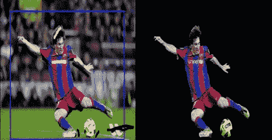
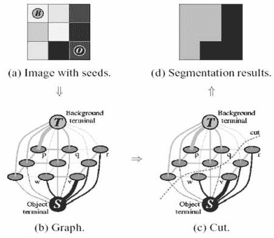
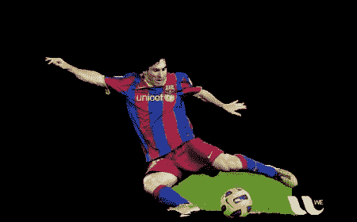
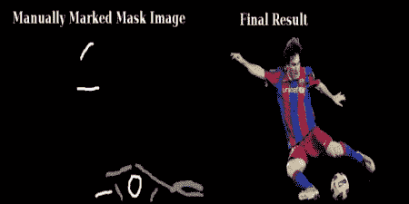

# 基于GrabCut算法的交互式前景提取

## 目标

在这一章当中

*   我们将看到GrabCut算法来提取图像中的前景
*   我们将为此创建一个交互式应用程序。

## 理论

GrabCut算法由Carsten Rother，Vladimir Kolmogorov＆amp;来自英国剑桥微软研究院的Andrew Blake。在他们的论文中，[“GrabCut”：使用迭代图切割](http://dl.acm.org/citation.cfm?id=1015720)进行交互式前景提取。前景提取需要一种算法，用户交互最少，结果就是GrabCut。

从用户的角度来看它是如何工作的？最初用户在前景区域周围绘制一个矩形（前景区域应该完全在矩形内）。然后算法迭代地对其进行分段以获得最佳结果。完成。但在某些情况下，分割将不会很好，例如，它可能已将某些前景区域标记为背景，反之亦然。在这种情况下，用户需要做精细的修饰。只需对图像进行一些描述，其中存在一些错误结果。笔划基本上说*“嘿，这个区域应该是前景，你标记它的背景，在下一次迭代中纠正它”*或它的背景相反。然后在下一次迭代中，您将获得更好的结果。

见下图。第一名球员和足球被包围在一个蓝色矩形中。然后进行一些具有白色笔划（表示前景）和黑色笔划（表示背景）的最终修饰。我们得到了一个很好的结果。

image

那背景会发生什么？

*   用户输入矩形。这个矩形之外的所有东西都将被视为确定的背景（这就是之前提到的矩形应该包括所有对象的原因）。矩形内的一切都是未知的。类似地，任何指定前景和背景的用户输入都被视为硬标签，这意味着它们不会在过程中发生变化。
*   计算机根据我们提供的数据进行初始标记。它标记前景和背景像素（或硬标签）
*   现在使用高斯混合模型（GMM）来模拟前景和背景。
*   根据我们提供的数据，GMM学习并创建新的像素分布。也就是说，未知像素被标记为可能的前景或可能的背景，这取决于其在颜色统计方面与其他硬标记像素的关系（它就像聚类一样）。
*   从该像素分布构建图形。图中的节点是像素。添加了另外两个节点，**源节点**和 **Sink节点**。每个前景像素都连接到源节点，每个背景像素都连接到Sink节点。
*   连接像素到源节点/端节点的边的权重由像素是前景/背景的概率来定义。像素之间的权重由边缘信息或像素相似性定义。如果像素颜色存在较大差异，则它们之间的边缘将获得较低的权重。
*   然后使用mincut算法来分割图形。它将图形切割成两个分离源节点和汇聚节点，具有最小的成本函数。成本函数是被切割边缘的所有权重的总和。切割后，连接到Source节点的所有像素变为前景，连接到Sink节点的像素变为背景。
*   该过程一直持续到分类收敛为止。

如下图所示（图片提供： [http://www.cs.ru.ac.za/research/g02m1682/](http://www.cs.ru.ac.za/research/g02m1682/) ）

image

## 演示

现在我们使用OpenCV进行抓取算法。 OpenCV具有此功能， **[cv.grabCut（）](../../d7/d1b/group__imgproc__misc.html#ga909c1dda50efcbeaa3ce126be862b37f "Runs the GrabCut algorithm. ")** 。我们将首先看到它的论点：

*   _img_ - 输入图像
*   _mask_ - 这是一个掩码图像，我们指定哪些区域是背景，前景或可能的背景/前景等。它由以下标志完成， **[cv.GC_BGD](../../d7/d1b/group__imgproc__misc.html#ggad43d3e4208d3cf025d8304156b02ba38a889f1ce109543e8aed80a7abbc6dcb39 "an obvious background pixels ") ， [cv.GC_FGD](../../d7/d1b/group__imgproc__misc.html#ggad43d3e4208d3cf025d8304156b02ba38a4757c1f0587bcf6e53e86dee7689a649 "an obvious foreground (object) pixel ") ， [cv.GC_PR_BGD](../../d7/d1b/group__imgproc__misc.html#ggad43d3e4208d3cf025d8304156b02ba38af748414821c7f39fab3493f9eed1eedf "a possible background pixel ") ， [cv.GC_PR_FGD](../../d7/d1b/group__imgproc__misc.html#ggad43d3e4208d3cf025d8304156b02ba38ad33184b73cb87e08d29e0a3411b7c863 "a possible foreground pixel ")**，或简单地将0,1,2,3传递给图像。
*   _rect_ - 它是一个矩形的坐标，包括格式为（x，y，w，h）的前景对象
*   _bdgModel_ ， _fgdModel_ - 这些是内部算法使用的数组。您只需创建两个大小为（n = 1.65）的np.float64类型零数组。
*   _iterCount_ - 算法运行的迭代次数。
*   _模式_ - 它应该是 **[cv.GC_INIT_WITH_RECT](../../d7/d1b/group__imgproc__misc.html#ggaf8b5832ba85e59fc7a98a2afd034e558a5f8853c1e5a89c4aa2687d1f78a7e550)**或 **[cv.GC_INIT_WITH_MASK](../../d7/d1b/group__imgproc__misc.html#ggaf8b5832ba85e59fc7a98a2afd034e558ab01527c7effb50fd1c54d8c4e671ed22)**或合并后决定我们是否正在绘图矩形或最终修饰笔画。

首先让我们看看矩形模式。我们加载图像，创建一个类似的蒙版图像。我们创建 _fgdModel_ 和 _bgdModel_ 。我们给出矩形参数。这一切都是直截了当的。让算法运行5次迭代。模式应该是 _[cv.GC_INIT_WITH_RECT](../../d7/d1b/group__imgproc__misc.html#ggaf8b5832ba85e59fc7a98a2afd034e558a5f8853c1e5a89c4aa2687d1f78a7e550)_，因为我们使用的是矩形。然后运行抓取。它修改了蒙版图像。在新的掩模图像中，像素将标记有四个标记，表示背景/前景，如上所述。因此，我们修改掩模，使得所有0像素和2像素都被置为0（即背景），并且所有1像素和3像素被置为1（即前景像素）。现在我们的最后面具准备好了。只需将其与输入图像相乘即可得到分割后的图像。

```
import numpy as npimport cv2 as cvfrom matplotlib import pyplot as pltimg = cv.imread('messi5.jpg')mask = np.zeros(img.shape[:2],np.uint8)bgdModel = np.zeros((1,65),np.float64)fgdModel = np.zeros((1,65),np.float64)rect = (50,50,450,290)cv.grabCut(img,mask,rect,bgdModel,fgdModel,5,cv.GC_INIT_WITH_RECT)mask2 = np.where((mask==2)|(mask==0),0,1).astype('uint8')img = img*mask2[:,:,np.newaxis]plt.imshow(img),plt.colorbar(),plt.show()
```

请参阅以下结果：

image

哎呀，梅西的头发都没了。 _谁没有他的头发喜欢梅西？_ 我们需要把它带回来。所以我们将用1像素（确定的前景）给出一个精细的修饰。与此同时，有些地方已经出现了我们不想要的图片，还有一些标识。我们需要删除它们。在那里我们提供一些0像素的修饰（确定背景）。因此，正如我们现在所说的那样，我们在前一种情

_我实际上做的是，我在绘画应用程序中打开了输入图像，并在图像中添加了另一层。在画中使用画笔工具，我在这个新图层上标记了带有黑色的白色和不需要的背景（如徽标，地面等）的前景（头发，鞋子，球等）。然后用灰色填充剩余的背景。然后在OpenCV中加载该掩模图像，编辑我们在新添加的掩模图像中使用相应值的原始掩模图像。检查以下代码：_

```
# newmask is the mask image I manually labellednewmask = cv.imread('newmask.png',0)# wherever it is marked white (sure foreground), change mask=1# wherever it is marked black (sure background), change mask=0mask[newmask == 0] = 0mask[newmask == 255] = 1mask, bgdModel, fgdModel = cv.grabCut(img,mask,None,bgdModel,fgdModel,5,cv.GC_INIT_WITH_MASK)mask = np.where((mask==2)|(mask==0),0,1).astype('uint8')img = img*mask[:,:,np.newaxis]plt.imshow(img),plt.colorbar(),plt.show()
```

看下面的结果：

image

就是这样了。这里不是在rect模式下初始化，而是直接进入掩码模式。只需用2像素或3像素（可能的背景/前景）标记蒙版图像中的矩形区域。然后像我们在第二个例子中那样用1像素标记我们的sure_foreground。然后直接应用具有掩码模式的grabCut函数。

## 其他资源

## 演习

1.  OpenCV示例包含一个示例grabcut.py，它是一个使用grabcut的交互式工具。核实。另请观看 [youtube视频](http://www.youtube.com/watch?v=kAwxLTDDAwU)如何使用它。
2.  在这里，您可以将其制作成交互式样本，使用鼠标绘制矩形和笔划，创建轨迹栏以调整笔划宽度等。