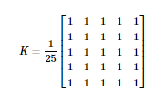
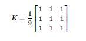
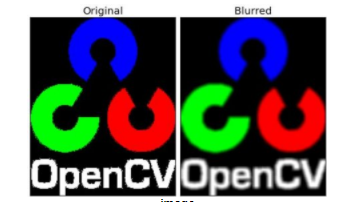
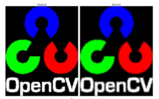
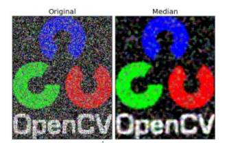
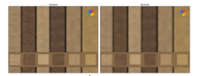

# 目标

在本教程中将学习：

* 用各种低通滤波器模糊图像。
* 对图像应用自定义过滤器（二维卷积）。

## 二维卷积(图像滤波)

与一维信号一样，图像也可以通过各种低通滤波器（LPF）、高通滤波器（HPF）等进行过滤。LPF 有助于消除噪音、模糊图像等。HPF 滤波器有助于在图像中找到边缘。

opencv 提供了函数 **[cv.filter2D()](https://docs.opencv.org/4.0.0/d4/d86/group__imgproc__filter.html#ga27c049795ce870216ddfb366086b5a04)**，用于将内核与图像卷积起来。作为一个例子，我们将尝试对图像进行均值滤波操作。5x5 均值滤波卷积核如下：

$$
K = \frac{1}{25} \begin{bmatrix} 1 & 1 & 1 & 1 & 1 \\ 1 & 1 & 1 & 1 & 1 \\ 1 & 1 & 1 & 1 & 1 \\ 1 & 1 & 1 & 1 & 1 \\ 1 & 1 & 1 & 1 & 1 \end{bmatrix}
$$




操作如下：将该内核中心与一个像素对齐，然后将该内核下面的所有 25 个像素相加，取其平均值，并用新的平均值替换这个25x25窗口的中心像素。它继续对图像中的所有像素执行此操作。试试下面这段代码并观察结果：

```python
import numpy as np
import cv2 as cv
from matplotlib import pyplot as plt
img = cv.imread('opencv_logo.png')
kernel = np.ones((5,5),np.float32)/25
dst = cv.filter2D(img,-1,kernel)
plt.subplot(121),plt.imshow(img),plt.title('Original')
plt.xticks([]), plt.yticks([])
plt.subplot(122),plt.imshow(dst),plt.title('Averaging')
plt.xticks([]), plt.yticks([])
plt.show()
```

结果如下：


## 图像模糊（图像平滑）

图像模糊是通过将图像与低通滤波核卷积来实现的。它有助于消除噪音。它实际上从图像中删除高频内容（例如：噪声、边缘）。所以在这个操作中边缘有点模糊。（好吧，有一些模糊技术不会使边缘太模糊）。OpenCV 主要提供四种模糊技术。

### 1、均值模糊

这是通过用一个归一化的滤波器内核与图像卷积来完成的。它只需取内核区域下所有像素的平均值并替换中心元素。这是通过函数 **[cv.blur()](https://docs.opencv.org/4.0.0/d4/d86/group__imgproc__filter.html#ga8c45db9afe636703801b0b2e440fce37)**或 **[cv.boxFilter()](https://docs.opencv.org/4.0.0/d4/d86/group__imgproc__filter.html#gad533230ebf2d42509547d514f7d3fbc3)**完成的。有关内核的更多详细信息，请查看文档。我们应该指定滤波器内核的宽度和高度。3x3 标准化框滤波器如下所示：



>**注意**
>如果你不用标准化滤波，使用 **[cv.boxFilter()](https://docs.opencv.org/4.0.0/d4/d86/group__imgproc__filter.html#gad533230ebf2d42509547d514f7d3fbc3)**，传入 normalize=False 参数。

5x5 核的简单应用如下所示:

```python
mport cv2 as cv
import numpy as np
from matplotlib import pyplot as plt
img = cv.imread('opencv-logo-white.png')
blur = cv.blur(img,(5,5))
plt.subplot(121),plt.imshow(img),plt.title('Original')
plt.xticks([]), plt.yticks([])
plt.subplot(122),plt.imshow(blur),plt.title('Blurred')
plt.xticks([]), plt.yticks([])
plt.show()
```

结果:

$$
K = \frac{1}{9} \begin{bmatrix} 1 & 1 & 1 \\ 1 & 1 & 1 \\ 1 & 1 & 1 \end{bmatrix}
$$




### 2、高斯模糊

在这种情况下，使用高斯核代替了核滤波器。它是通过函数 **[cv.GaussianBlur()](https://docs.opencv.org/4.0.0/d4/d86/group__imgproc__filter.html#gaabe8c836e97159a9193fb0b11ac52cf1)**完成的。我们应该指定内核的宽度和高度，它应该是正数并且是奇数(奇数才有一个中位数)。我们还应该分别指定 x 和 y 方向的标准偏差、sigmax 和 sigmay。如果只指定 sigmax，则 sigmay 与 sigmax 相同。如果这两个值都是 0，那么它们是根据内核大小计算出来的。高斯模糊是消除图像高斯噪声的有效方法。

如果需要，可以使用函数 **[cv.getGaussianKernel()](https://docs.opencv.org/4.0.0/d4/d86/group__imgproc__filter.html#gac05a120c1ae92a6060dd0db190a61afa)**创建高斯内核。

上述代码可以修改为高斯模糊：

```python
blur = cv.GaussianBlur(img,(5,5),0)
```

结果:



### 3、中值滤波

在这里，函数 **[cv.medianBlur()](https://docs.opencv.org/4.0.0/d4/d86/group__imgproc__filter.html#ga564869aa33e58769b4469101aac458f9)**取内核区域下所有像素的中值，将中央元素替换为该中值。这对图像中的椒盐噪声非常有效。有趣的是，在上面的过滤器中，中心元素是一个新计算的值，它可能是图像中的像素值，也可能是一个新值。但在中值模糊中，中心元素总是被图像中的一些像素值所取代，可以有效降低噪音。它的内核大小应该是一个正的奇数整数。

在这个演示中，我在原始图像中添加了 50%的噪声，并应用了中间模糊。结果如下：

```python
median = cv.medianBlur(img,5)

```

结果:



### 4、双边滤波

**[cv.bilateralFilter()](https://docs.opencv.org/4.0.0/d4/d86/group__imgproc__filter.html#ga9d7064d478c95d60003cf839430737ed)**在保持边缘锐利的同时，对噪声去除非常有效。但与其他过滤器相比，操作速度较慢。我们已经看到高斯滤波器取像素周围的邻域并找到其高斯加权平均值。该高斯滤波器是一个空间函数，即在滤波时考虑相邻像素。但是它不考虑像素是否具有几乎相同的强度，也不考虑像素是否是边缘像素。所以它也会模糊边缘，这是我们不想做的。

双边滤波器在空间上也采用高斯滤波器，而另一个高斯滤波器则是像素差的函数。空间的高斯函数确保模糊只考虑邻近像素，而强度差的高斯函数确保模糊只考虑与中心像素强度相似的像素。所以它保留了边缘，因为边缘的像素会有很大的强度变化。

下面的示例显示使用双边滤波（有关参数的详细信息，请访问文档）。

```python
blur = cv.bilateralFilter(img,9,75,75)
```

结果:



## 其他资源

更多关于 **[双边滤波](http://people.csail.mit.edu/sparis/bf_course/)**

## 练习
