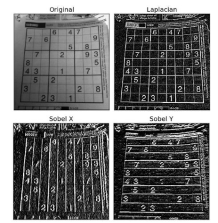

# 目标

在本教程中：

* 你会学到如何找到图像的梯度，边缘等。
* 你会学到如下函数：**[cv.Sobel()](https://docs.opencv.org/4.0.0/d4/d86/group__imgproc__filter.html#gacea54f142e81b6758cb6f375ce782c8d )**，**[cv.Scharr()](https://docs.opencv.org/4.0.0/d4/d86/group__imgproc__filter.html#gaa13106761eedf14798f37aa2d60404c9)**，**[cv.Laplacian()](https://docs.opencv.org/4.0.0/d4/d86/group__imgproc__filter.html#gad78703e4c8fe703d479c1860d76429e6)** 等。

## 理论

OpenCv 提供三种类型的梯度滤波器或高通滤波器，Sobel、Scharr 和 Laplacian。我们会逐步介绍。

### 1、Sobel 和 Scharr 微分

Sobel 算子是一种联合高斯平滑加微分运算，因此对噪声的抵抗能力更强。可以指定要计算的导数的方向，垂直或水平（分别由参数、Yorder 和 Xorder 指定）。还可以通过参数 ksize 指定内核的大小。如果 ksize=-1，则使用 3x3 Scharr 滤波器，这比 3x3 Sobel 滤波器效果更好。请参阅所用内核的文档。

### 2、Laplacian 微分

它计算由关系式$\Delta src = \frac{\partial ^2{src}}{\partial x^2} + \frac{\partial ^2{src}}{\partial y^2}$给出的图像的拉普拉斯式，其中使用 Sobel 微分计算每个导数。如果 ksize=1，则使用以下内核进行筛选：
$$
kernel = \begin{bmatrix} 0 & 1 & 0 \\ 1 & -4 & 1 \\ 0 & 1 & 0 \end{bmatrix}
$$


## 代码

下面的代码显示了一个完整的梯度计算流程中的所有操作。所有的内核都是 5x5 大小。输出图像的深度在参数传入-1时得到 np.uint8 类型的结果。

```python
import numpy as np
import cv2 as cv
from matplotlib import pyplot as plt
img = cv.imread('dave.jpg',0)
laplacian = cv.Laplacian(img,cv.CV_64F)
sobelx = cv.Sobel(img,cv.CV_64F,1,0,ksize=5)
sobely = cv.Sobel(img,cv.CV_64F,0,1,ksize=5)
plt.subplot(2,2,1),plt.imshow(img,cmap = 'gray')
plt.title('Original'), plt.xticks([]), plt.yticks([])
plt.subplot(2,2,2),plt.imshow(laplacian,cmap = 'gray')
plt.title('Laplacian'), plt.xticks([]), plt.yticks([])
plt.subplot(2,2,3),plt.imshow(sobelx,cmap = 'gray')
plt.title('Sobel X'), plt.xticks([]), plt.yticks([])
plt.subplot(2,2,4),plt.imshow(sobely,cmap = 'gray')
plt.title('Sobel Y'), plt.xticks([]), plt.yticks([])
plt.show()
```

结果:


## 一件重要的事！

在上一个示例中，输出数据类型是 cv.CV_8U或 np.uint8。但这有一个小问题。黑白过渡为正斜率（有正值），而白黑过渡为负斜率（有负值）。所以当你把数据转换成 np.uint8 时，所有的负斜率都变成零。简单来说，你失去了边缘。

如果要检测两条边，更好的选择是将输出数据类型保留为更高的格式，如 cv.CV_16S、cv.CV_64F 等，取其绝对值，然后转换回 cv.CV_8U。下面的代码演示了水平 Sobel滤波器的过程以及结果差异。

下面是代码:

```python
import numpy as np
import cv2 as cv
from matplotlib import pyplot as plt
img = cv.imread('box.png',0)
# Output dtype = cv.CV_8U
sobelx8u = cv.Sobel(img,cv.CV_8U,1,0,ksize=5)
# Output dtype = cv.CV_64F. Then take its absolute and convert to cv.CV_8U
sobelx64f = cv.Sobel(img,cv.CV_64F,1,0,ksize=5)
abs_sobel64f = np.absolute(sobelx64f)
sobel_8u = np.uint8(abs_sobel64f)
plt.subplot(1,3,1),plt.imshow(img,cmap = 'gray')
plt.title('Original'), plt.xticks([]), plt.yticks([])
plt.subplot(1,3,2),plt.imshow(sobelx8u,cmap = 'gray')
plt.title('Sobel CV_8U'), plt.xticks([]), plt.yticks([])
plt.subplot(1,3,3),plt.imshow(sobel_8u,cmap = 'gray')
plt.title('Sobel abs(CV_64F)'), plt.xticks([]), plt.yticks([])
plt.show()
```

结果为：



## 其他资源

## 练习
