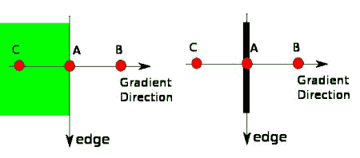
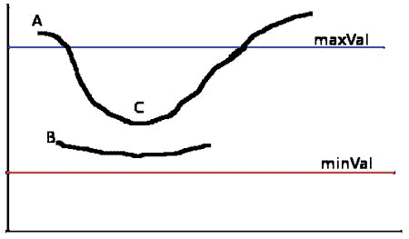
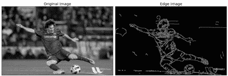

# Canny边缘检测

## 目标

在本章中，我们将了解

*   Canny边缘检测的概念
*   OpenCV的功能： **[cv.Canny（）](../../dd/d1a/group__imgproc__feature.html#ga04723e007ed888ddf11d9ba04e2232de "Finds edges in an image using the Canny algorithm  . ")**

## 理论

Canny边缘检测是一种流行的边缘检测算法。它是由John F. Canny在

1.  这是一个多阶段算法，我们将经历每个阶段。
2.  **降噪**

    由于边缘检测易受图像中的噪声影响，因此第一步是使用5x5高斯滤波器去除图像中的噪声。我们在前面的章节中已经看到了这一点。

3.  **寻找图像的强度梯度**

    然后在水平和垂直方向上用Sobel内核对平滑后的图像进行滤波，以获得水平方向（\（G_x \））和垂直方向（\（G_y \））的一阶导数。从这两个图像中，我们可以找到每个像素的边缘梯度和方向，如下所示：

    \ [Edge \ _Gradient \; （G）= \ sqrt {G_x ^ 2 + G_y ^ 2} \\ Angle \; （\ theta）= \ tan ^ { - 1} \ bigg（\ frac {G_y} {G_x} \ bigg）\]

    渐变方向始终垂直于边缘。它被四舍五入到表示垂直，水平和两个对角线方向的四个角度中的一个。

4.  **非最大抑制**

    在获得梯度幅度和方向之后，完成图像的全扫描以去除可能不构成边缘的任何不需要的像素。为此，在每个像素处，检查像素是否是其在梯度方向上的邻域中的局部最大值。检查下图：

    image

    A点位于边缘（垂直方向）。渐变方向与边缘垂直。 B点和C点处于梯度方向。因此，用点B和C检查点A，看它是否形成局部最大值。如果是这样，则考虑下一阶段，否则，它被抑制（归零）。

    简而言之，您得到的结果是具有“细边”的二进制图像。

5.  **滞后阈值**

    这个阶段决定哪些边缘都是边缘，哪些边缘不是边缘。为此，我们需要两个阈值，minVal和maxVal。强度梯度大于maxVal的任何边缘肯定是边缘，而minVal以下的边缘肯定是非边缘，因此被丢弃。位于这两个阈值之间的人是基于其连通性的分类边缘或非边缘。如果它们连接到“可靠边缘”像素，则它们被视为边缘的一部分。否则，他们也被丢弃。见下图：

    image

    边缘A高于maxVal，因此被视为“确定边缘”。虽然边C低于maxVal，但它连接到边A，因此也被视为有效边，我们得到完整的曲线。但是边缘B虽然高于minVal并且与边缘C的区域相同，但它没有连接到任何“可靠边缘”，因此被丢弃。因此，我们必须相应地选择minVal和maxVal才能获得正确的结果。

    在假设边是长线的情况下，该阶段也消除了小像素噪声。

所以我们最终得到的是图像中的强边缘。

## OpenCV中的Canny边缘检测

OpenCV将以上所有内容放在单个函数中， **[cv.Canny（）](../../dd/d1a/group__imgproc__feature.html#ga04723e007ed888ddf11d9ba04e2232de "Finds edges in an image using the Canny algorithm  . ")** 。我们将看到如何使用它。第一个参数是我们的输入图像。第二个和第三个参数分别是我们的minVal和maxVal。第三个参数是aperture_size。它是用于查找图像渐变的Sobel内核的大小。默认情况下，它是3.最后一个参数是L2gradient，它指定用于查找梯度幅度的等式。如果它是True，它使用上面提到的更准确的等式，否则它使用这个函数：\（Edge \ _Gradient \;（G）= | G_x | + | G_y | \）。默认情况下，它为False。

```
import numpy as npimport cv2 as cvfrom matplotlib import pyplot as pltimg = cv.imread('messi5.jpg',0)edges = cv.Canny(img,100,200)plt.subplot(121),plt.imshow(img,cmap = 'gray')plt.title('Original Image'), plt.xticks([]), plt.yticks([])plt.subplot(122),plt.imshow(edges,cmap = 'gray')plt.title('Edge Image'), plt.xticks([]), plt.yticks([])plt.show()
```

看下面的结果：

image

## 其他资源

1.  [维基百科](http://en.wikipedia.org/wiki/Canny_edge_detector)的Canny边缘探测器
2.  [Canny边缘检测教程](http://dasl.unlv.edu/daslDrexel/alumni/bGreen/www.pages.drexel.edu/_weg22/can_tut.html)，作者Bill Green，2002年。

## 演习

1.  编写一个小应用程序来查找Canny边缘检测，其阈值可以使用两个轨道栏进行更改。这样，您就可以了解阈值的影响。