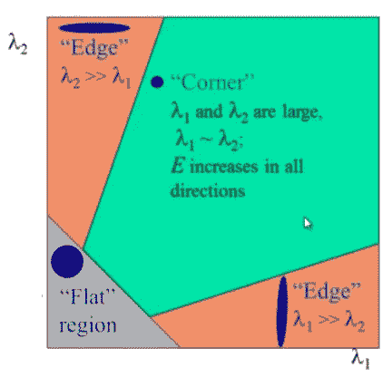
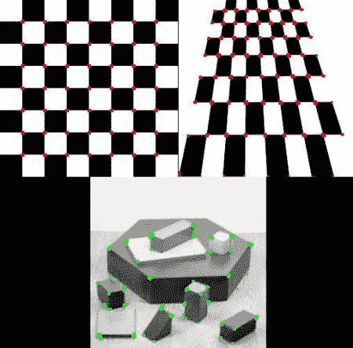
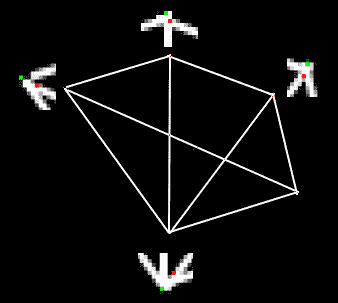

# Harris 角点检测

## 目标

在这一章当中，

- 我们将了解 Harris 角点检测背后的概念。
- 我们将看到函数： **[cv.cornerHarris()](https://docs.opencv.org/4.0.0/dd/d1a/group__imgproc__feature.html#gac1fc3598018010880e370e2f709b4345)** ， **[cv.cornerSubPix()](https://docs.opencv.org/4.0.0/dd/d1a/group__imgproc__feature.html#ga354e0d7c86d0d9da75de9b9701a9a87e)**

## 理论

在上一章中，我们看到角点是图像中的区域，在所有方向上的强度变化都很大。找到这些角点的一个早期尝试出现在**Chris Harris 和 Mike Stephens**1988 年的论文 **A Combined Corner and Edge Detector**中，因此现在它被称为 Harris 角点探测器。他把这个简单的想法变成了数学形式。基本原理是将窗口向各个方向上位移$$(u,v)$$，然后计算滑动前后强度差异的总和。表达式如下：

$$E(u,v) = \sum_ {x,y} \underbrace{w(x,y)} _ {window function} [\underbrace{I(x+u,y+v)} _  {shifted intensity}-\underbrace{I(x,y)} _ {intensity}] ^ 2$$

窗口函数可以是矩形窗口，也可以是对每个像素赋予不同权重的高斯窗口。

我们必须使$$E(u,v)$$的值最大化以进行角点检测。这意味着，必须最大化方程右侧的第二项。将泰勒展开应用于上述方程并进行一些数学转换（请参考您喜欢的任何标准教科书进行完全推导），我们得到最终的等式：

$$E(u,v) \approx \begin {bmatrix} u&v \end {bmatrix} M \begin {bmatrix} u \\ v \end {bmatrix}$$

其中

$$M = \sum_ {x,y} w(x,y)\begin{bmatrix} I_x I_x&I_x I_y \\ I_x I_y&I_y I_y \end{bmatrix} $$

这里$$I_x$$和$$I_y $$分别是 x 和 y 方向的图像导数。（可以使用 **[cv.Sobel()](https://docs.opencv.org/4.0.0/d4/d86/group__imgproc__filter.html#gacea54f142e81b6758cb6f375ce782c8d)** 计算得到）。

然后是主要部分。在此之后，他们建立了一个等式来评分，从而判断窗口中是否含有角点：

$$R = det(M)-k(trace(M))^ 2$$

其中

- $$det(M)=\lambda_1 \lambda_2$$
- $$trace(M)= \lambda_1+\lambda_2$$
- $$\lambda_1$$和$$\lambda_2$$是 M 的特征值

根据这些特征值可以判断一个区域是角点，边缘还是平面。

- 当$$\lambda_1$$和$$\lambda_2$$都很小时，$$| R |$$也很小，该区域是平面。
- 当$$\lambda_1\gt\gt\lambda_2$$或者$$\lambda_2\gt\gt\lambda_1$$时，$$R\lt0$$，该区域是边缘。
- 当$$\lambda_1$$和$$\lambda_2$$大且$$\lambda_1 \sim \lambda_2$$时，$$R$$很大，该区域是一个角点。

上述结论可以用下图表示：



因此，Harris 角点检测的结果是具有这些分数的灰度图像。选取适当的阈值即可筛选出图像中的角点。我们将用一个简单的图像来进行演示。

## OpenCV 中的 Harris 角点检测器

OpenCV 中的 **[cv.cornerHarris()](https://docs.opencv.org/4.0.0/dd/d1a/group__imgproc__feature.html#gac1fc3598018010880e370e2f709b4345)** 函数用来实现 Harris 角点检测。它的参数是：

- **img** - 输入图像，应为 float32 类型的灰度图。
- **blockSize** - 角点检测所考虑的邻域大小。
- **ksize** - Sobel 导数的内核大小。
- **k** - Harris 检测器方程中的自由参数。

请参阅以下示例：

```python
import numpy as np
import cv2 as cv
filename = 'chessboard.png'
img = cv.imread(filename)
gray = cv.cvtColor(img,cv.COLOR_BGR2GRAY)
gray = np.float32(gray)
dst = cv.cornerHarris(gray,2,3,0.04)
#result is dilated for marking the corners, not important
dst = cv.dilate(dst,None)
# Threshold for an optimal value, it may vary depending on the image.
img[dst>0.01*dst.max()]=[0,0,255]
cv.imshow('dst',img)
if cv.waitKey(0) & 0xff == 27:
    cv.destroyAllWindows()
```

以下是三个结果：



## 具有亚像素级精度的角点

有时，您可能需要以最高精度找到角点。OpenCV 带有一个函数 **[cv.cornerSubPix()](https://docs.opencv.org/4.0.0/dd/d1a/group__imgproc__feature.html#ga354e0d7c86d0d9da75de9b9701a9a87e)** ，它进一步细化了角点检测，以达到亚像素级精度。以下是一个例子。像往常一样，我们需要先找到 Harris 角点。然后将这些角的质心（角点处可能有一堆像素，我们采用它们的质心）传递给该函数来细化它们。Harris 角点以红色像素标记，细化后的角点以绿色像素标记。对于此函数，我们必须定义迭代停止的条件。我们在经过指定次数的迭代或达到一定精度后停止它，以先发生者为准。我们还需要定义进行角点搜索的邻域大小。

```python
import numpy as np
import cv2 as cv
filename = 'chessboard2.jpg'
img = cv.imread(filename)
gray = cv.cvtColor(img,cv.COLOR_BGR2GRAY)
# find Harris corners
gray = np.float32(gray)
dst = cv.cornerHarris(gray,2,3,0.04)
dst = cv.dilate(dst,None)
ret, dst = cv.threshold(dst,0.01*dst.max(),255,0)
dst = np.uint8(dst)
# find centroids
ret, labels, stats, centroids = cv.connectedComponentsWithStats(dst)
# define the criteria to stop and refine the corners
criteria = (cv.TERM_CRITERIA_EPS + cv.TERM_CRITERIA_MAX_ITER, 100, 0.001)
corners = cv.cornerSubPix(gray,np.float32(centroids),(5,5),(-1,-1),criteria)
# Now draw them
res = np.hstack((centroids,corners))
res = np.int0(res)
img[res[:,1],res[:,0]]=[0,0,255]
img[res[:,3],res[:,2]] = [0,255,0]
cv.imwrite('subpixel5.png',img)
```

下面是结果，其中的一些重要位置进行了缩放：



## 其他资源

## 练习
