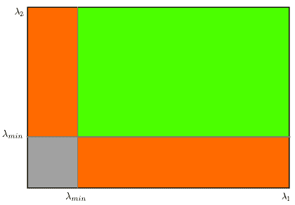
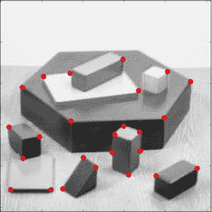

# Shi-Tomasi 角点检测和追踪的良好特征

## 目标

在这一章当中，

- 我们将了解另一个角落探测器：Shi-Tomasi 角落探测器
- 我们将看到函数： **[cv.goodFeaturesToTrack()](https://docs.opencv.org/4.0.0/dd/d1a/group__imgproc__feature.html#ga1d6bb77486c8f92d79c8793ad995d541)**

## 理论

在上一章中，我们看到了 Harris 角点检测。 之后在 1994 年，J. Shi 和 C. Tomasi 在他们的论文 **Good Features to Track** 中做了一个小修改，与 Harris 角点检测相比显示出更好的结果。Harri 角点检测的评分由下式给出：

$$R = \lambda_1 \lambda_2 - k(\lambda_1 + \lambda_2)^ 2$$

不同于此，Shi-Tomasi 提出：

$$R = min(\lambda_1,\lambda_2)$$

如果它大于阈值，则将其视为角点。如果我们像在 Harris 角点检测中那样将它绘制在$$\lambda_1- \lambda_2$$空间中，将得到如下图像：



从图中可以看出，只有当$$\lambda_1$$和$$\lambda_2$$都大于最小值$$\lambda_ {min}$$时，它才被视为一个角点（绿色区域）。

## 代码

OpenCV 有一个函数， **[cv.goodFeaturesToTrack()](https://docs.opencv.org/4.0.0/dd/d1a/group__imgproc__feature.html#ga1d6bb77486c8f92d79c8793ad995d541)** 。它通过 Shi-Tomasi 方法（或 Harris 角点检测，如果你指定它）在图像中找到 N 个最佳的角点。像往常一样，图像应该是灰度图像。然后指定要查找的角点数量。然后指定质量等级，该等级是 0-1 之间的值，所有低于这个质量等级的角点都将被忽略。最后设置检测到的两个角点之间的最小欧氏距离。

通过所有这些信息，该函数可以在图像中找到角点。所有低于质量等级的角点都将被忽略。然后它根据质量按降序对剩余的角点进行排序。该函数选定质量等级最高的角点（即排序后的第一个角点），忽略该角点最小距离范围内的其余角点，以此类推最后返回 N 个最佳的角点。

在下面的例子中，我们将尝试找到 25 个最佳角点：

```python
import numpy as np
import cv2 as cv
from matplotlib import pyplot as plt
img = cv.imread('blox.jpg')
gray = cv.cvtColor(img,cv.COLOR_BGR2GRAY)
corners = cv.goodFeaturesToTrack(gray,25,0.01,10)
corners = np.int0(corners)
for i in corners:
    x,y = i.ravel()
    cv.circle(img,(x,y),3,255,-1)
plt.imshow(img),plt.show()
```

结果如下：



以后我们会发现这个函数更适合在目标追踪中使用。

## 其他资源

## 练习
