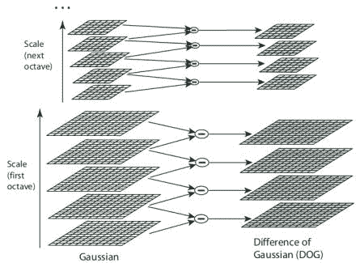
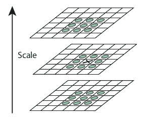
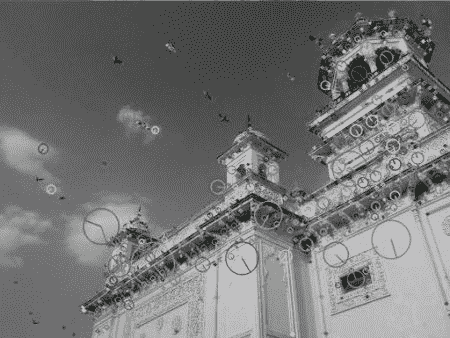

# SIFT 简介（尺度不变特征变换）

## 目标

在这一章当中，

- 我们将了解 SIFT 算法的概念
- 我们将学习如何找到 SIFT 特征点和描述子。

## 理论

在前几章中，我们看到了一些角点检测器，如 Harris 等。它们具有旋转不变性，这意味着，即使图像旋转，我们也可以找到相同的角点。很明显，因为角点在旋转图像中也是角点。但是缩放呢？如果图像缩放，角点可能就不再是角点。以下图为例，在小图像中使用一个小窗口能够检测出角点，然而将图像放大后，在同一窗口中的图像变得平坦，无法检测出角点。所以 Harris 角点不是尺度不变的。


因此，在 2004 年，不列颠哥伦比亚大学的 **D.Lowe** 在他的论文**Distinctive Image Features from Scale-Invariant Keypoints**中提出了一种新算法，尺度不变特征变换（SIFT），用以提取特征点并计算其描述子。 *（这篇论文易于理解，被认为关于 SIFT 的最佳材料。以下解释只是对该论文的简短摘要）*。

SIFT 算法主要涉及四个步骤。我们将逐一看到它们。

### 1.尺度空间极值检测

从上图可以看出，我们不能使用同一个窗口来检测不同尺度空间中的角点。检测小的角点可以用小的窗口，但检测更大的角点则需要更大的窗口。为此需要进行尺度空间滤波。使用不同$$\sigma$$值的高斯拉普拉斯算子（LoG）对图像进行卷积。 具有不同$$\sigma$$值的 LoG 可以检测不同大小的斑点。简而言之，$$\sigma$$相当于一个尺度变换因子。例如，在上图中，使用具有低$$\sigma$$的高斯核可以检测出小的角点，而具有高$$\sigma$$的高斯核则适合于检测大的角点。因此，我们可以在尺度空间和二维平面中找到局部最大值$$(x, y, \sigma)$$，这意味着在$$\sigma$$尺度中的(x,y)处有一个潜在的特征点。

但是 LoG 的计算量非常大，因此 SIFT 算法使用高斯差分，这是 LoG 的近似值。分别使用方差值为$$\sigma$$和$$k\sigma$$的高斯核对图像进行模糊，对所得的结果再求二者的差值就是 DoG。如下图所示：



找到 DoG 后，搜索不同尺度空间和二维平面中的局部最大值。例如，将图像中的一个像素与其 8 领域、尺度空间上一层中相邻的 9 个像素以及尺度空间下一层中相邻的 9 个像素做比较。如果它是一个局部最大值，那么它就是一个潜在的特征点。基本上可以说特征点是相应尺度空间的最佳代表。如下图所示：



对于参数的取值论文中给出了一些经验数据，可以概括为：octaves= 4，尺度等级数为 5，初始$$\sigma$$ = 1.6 ，$$k = \sqrt {2} $$作为最佳值。
### 2.特征点定位

一旦找到潜在的特征点，就必须对其进行细化以获得更准确的结果。论文作者使用尺度空间的泰勒展开来获得更准确的极值位置，并且如果此极值处的强度小于阈值（0.03），则将其忽略。该阈值在 OpenCV 中被称为**contrastThreshold**。

DoG 对边缘更加敏感，因此需要去除边缘。为此，使用了类似于 Harris 角点检测的思路。论文作者使用 2x2 Hessian 矩阵（H）来计算主曲率。我们从 Harris 角点检测得知，当一个特征值大于另一个特征值时检测到的是边界。所以这里论文作者使用了一个简单的函数，如果比率大于阈值则丢弃该特征点，在 OpenCV 中这个比率被称为 **edgeThreshold** 。论文中给出的边界阈值是 10。

所以，任何低对比度特征点点和边缘特征点被去除后，剩下的就是我们所感兴趣的特征点。

### 3.指定方向

现在，为每个特征点指定方向，以实现图像旋转的不变性。获取特征点所在的尺度空间的领域，并且在计算该区域的梯度大小和方向。创建了一个包含 36 个 bins（每 10°一个 bin，覆盖了 360°）的方向直方图（由梯度幅度和圆形高斯窗口加权，其中高斯窗口的$$\sigma$$等于当前特征点尺度空间$$\sigma$$的 1.5 倍）。采用直方图中的最高峰为主方向，同时也考虑其余任何高于最高峰 80％的峰来计算方向。这就会创建具有相同位置和尺度空间但不同方向的特征点。这样做有助于匹配的稳定性。

### 4.特征点描述子

现在创建特征点描述子。在关键点周围选取 16x16 的邻域。将它为 16 个 4x4 大小的子块。对于每个子块，创建包含 8 个 bin 的方向直方图。因此总共有 128 个 bin 值可用。由这 128 个形成的向量构成了特征点描述子。除此之外，还采取了一些措施来实现对光照变化，旋转等的鲁棒性。

### 5.特征点匹配

通过识别两幅图像中距离最近的特征点来进行特征点匹配。但在某些情况下，第二个最接近的匹配可能非常接近第一个。它可能由噪音或其他原因而引起。在这种情况下，计算最近距离与第二最近距离的比率。如果比率大于 0.8，则忽略它们。根据论文，这样做消除了大约 90％的错误匹配，而同时只去除了 5％的正确匹配。

以上是 SIFT 算法的总结。关于更多详细信息和理解，强烈建议阅读原始论文。记住一件事，这个算法受到专利保护，所以这个算法被包含在 [opencv contrib repo](https://github.com/opencv/opencv_contrib) 中。

## OpenCV 中的 SIFT

现在让我们看看 OpenCV 中提供的 SIFT 函数。让我们从特征点检测及绘制开始。首先，我们必须构造一个 SIFT 对象。我们可以使用不同的参数，这不是必须的，关于参数的解释可参考文档。

```python
import numpy as np
import cv2 as cv
img = cv.imread('home.jpg')
gray= cv.cvtColor(img,cv.COLOR_BGR2GRAY)
sift = cv.xfeatures2d.SIFT_create()
kp = sift.detect(gray,None)
img=cv.drawKeypoints(gray,kp,img)
cv.imwrite('sift_keypoints.jpg',img)
```

**sift.detect()**函数查找图像中的特征点。如果只想搜索图像的一部分，则可以传递一个掩模。返回的每个特征点都是一个特殊的结构，它有许多属性，如(x,y)坐标，有意义邻域的大小，指定方向的角度，指定特征点强度的响应等。

OpenCV 还提供 **cv.drawKeyPoints()**函数，该函数在特征点的位置上绘制小圆圈。如果您向其传递一个标志 **cv.DRAW_MATCHES_FLAGS_DRAW_RICH_KEYPOINTS** ，它将绘制一个特征点大小的圆圈，它甚至会显示其方向。见下面的例子。

```python
img=cv.drawKeypoints(gray,kp,img,flags=cv.DRAW_MATCHES_FLAGS_DRAW_RICH_KEYPOINTS)
cv.imwrite('sift_keypoints.jpg',img)
```

请参阅以下两个结果：



现在要计算描述子，OpenCV 提供了两种方法。

1. 既然你已经找到了特征点，你可以调用 **sift.compute()**来计算我们找到的特征点的描述子。例如：kp,des = sift.compute(gray,kp)。
2. 如果您没有找到特征点，请使用函数 **sift.detectAndCompute()**在一个步骤中直接查找特征点和描述子。

我们将看到第二种方法：

```python
sift = cv.xfeatures2d.SIFT_create()
kp, des = sift.detectAndCompute(gray,None)
```

这里 kp 是一个特征点列表，des 是一个 numpy 数组，该数组大小是特征点数目乘 128。

所以我们得到了特征点，描述子等。现在我们想看看如何匹配不同图像中的特征点。我们将在接下来的章节中学习。

## 其他资源

## 练习
