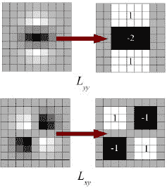
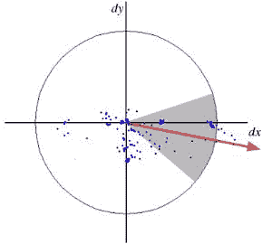
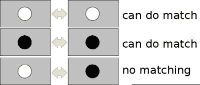
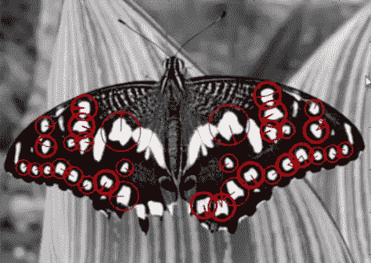

# SURF 简介（加速鲁棒特性）

## 目标

在这一章当中，

- 我们将看到 SURF 的基础知识
- 我们将看到 OpenCV 中的 SURF

## 理论

在上一章中，我们看到了使用 SIFT 算法进行特征点的检测和描述。但它相对较慢，人们需要更加快速的算法。 2006 年，Bay，H.，Tuytelaars，T.和 Van Gool，L 三人发表了另一篇论文“SURF：Speeded Up Robust Features”，引入了一种名为 SURF 的新算法。顾名思义，它是 SIFT 的加速版本。

在 SIFT 中，Lowe 用高斯差分（DoG）去近似高斯拉普拉斯算子（LoG），从而构造尺度空间。 SURF 则更进一步，用盒子滤波器去近似 LoG。下图显示了这种近似。这种近似的一个很大的优点是，借助积分图像可以很容易地计算出盒子滤波器的卷积，而且可以在不同的尺度空间同时进行计算。同样，SURF 依赖于 Hessian 矩阵的行列式去计算特征点的尺度和位置。



对于主方向，在 SURF 中是对以特征点为中心的 6s（s 为特征点的尺度）为半径的圆形区域内的图像进行 Haar 小波响应运算得到的。使用高斯函数对小波响应进行加权。然后将它们绘制在下图中给出的图像中。通过计算角度为 60 度的定向滑动窗口内的所有响应的总和来估算主方向。有趣的是，任意尺度空间上的小波响应都可以很容易地使用积分图像找到。对于许多应用，不需要旋转不变性，因此无需找到此方向，从而加快了过程。 SURF 提供被称为 Upright-SURF 或 U-SURF 的功能。它可以提高速度，并且保持了对$$\pm 15 ^ {\circ} $$旋转的鲁棒性。 OpenCV 支持这两种模式，取决于**upright**标志位。如果标志位为 0，则计算方向。如果为 1，则不计算方向同时速度更快。



对于特征描述，SURF 在水平和垂直方向上使用小波响应（再次，使用积分图像使事情变得更容易）。在特征点周围获取大小为 20sX20s 的邻域，其中 s 是特征点尺度大小。将它分为 4x4 子区域。对于每个子区域，采用水平和垂直小波响应，并形成一个像这样的矢量，$$v =（\sum {d_x}，\sum {d_y}，\sum {| d_x |}，\sum {| d_y | }）$$。当表示为矢量时，这就是 64 维的 SURF 特征点描述子。（与 SIFT 相比）描述子的维度降低了，计算和匹配的速度提高了，但又提供了更具有独特性的特征。

为了增加特征点的独特性，SURF 特征点描述子具有扩展的 128 维版本。 在$$d_y\lt 0$$和$$d_y \geq 0$$时分别计算$$d_x$$和$$| d_x | $$的和。类似地，$$d_y $$和$$| d_y | $$的和也根据$$d_x $$的符号进行区分，从而使特征数量加倍，但不会增加太多的计算复杂性。 OpenCV 支持将 **extended**标志位的值分别设置为 0 和 1，0 为 64 维，1 为 128 维（默认为 128 维）。

另一个重要的改进是使用拉普拉斯算子（Hessian 矩阵的迹）作为潜在特征点。它不增加计算成本，因为它已经在检测期间计算出来。拉普拉斯算子的符号将黑暗背景上的明亮斑点与相反情况区分开来。在匹配阶段，我们只比较具有相同类型对比度的特征（如下图所示）。这种方法可以更快地匹配，而不会降低描述子的性能。



简而言之，SURF 采用了许多方法来提高每一步的速度。分析显示在性能相当的情况下它比 SIFT 快 3 倍。 SURF 擅长处理模糊和旋转的图像，但不善于处理视角变化和光照变化。

## OpenCV 中的 SURF

OpenCV 就像 SIFT 一样提供 SURF 功能。您使用一些可选参数（如 64/128-dim 描述符，Upright / Normal SURF 等）构造 SURF 对象。所有详细信息都在文档中进行了详细说明。然后就像我们在 SIFT 中所做的那样，我们可以使用 SURF.detect()，SURF.compute()等来查找特征点和描述子。

首先，我们将看到一个关于如何查找 SURF 特征点和描述子并绘制它的简单演示。由于与 SIFT 相同因此所有示例都显示在 Python 终端中。

```python
>>> img = cv.imread('fly.png',0)
# Create SURF object. You can specify params here or later.
# Here I set Hessian Threshold to 400
>>> surf = cv.xfeatures2d.SURF_create(400)
# Find keypoints and descriptors directly
>>> kp, des = surf.detectAndCompute(img,None)
>>> len(kp)
 699
```

1199 个关键点太多，无法在图片中显示。我们将它减少到大约 50 以将其绘制在图像上。在匹配时，我们可能需要所有这些功能，但现在不需要。所以我们增加了 Hessian 阈值。

```python
# Check present Hessian threshold
>>> print( surf.getHessianThreshold() )
400.0
# We set it to some 50000. Remember, it is just for representing in picture.
# In actual cases, it is better to have a value 300-500
>>> surf.setHessianThreshold(50000)
# Again compute keypoints and check its number.
>>> kp, des = surf.detectAndCompute(img,None)
>>> print( len(kp) )
47
```

现在小于 50 了，让我们在图像上绘制。

```python
>>> img2 = cv.drawKeypoints(img,kp,None,(255,0,0),4)
>>> plt.imshow(img2),plt.show()
```

请参阅下面的结果。你可以看到 SURF 更像是斑点检测器。它检测到蝴蝶翅膀上的白色斑点。您可以使用其他图像进行测试。



现在我想试一下 U-SURF，不检测特征点的方向。

```python
# Check upright flag, if it False, set it to True
>>> print( surf.getUpright() )
False
>>> surf.setUpright(True)
# Recompute the feature points and draw it
>>> kp = surf.detect(img,None)
>>> img2 = cv.drawKeypoints(img,kp,None,(255,0,0),4)
>>> plt.imshow(img2),plt.show()
```


请参阅下面的结果。所有方向都以相同的方向显示。它比以前更快。如果您的工作中不需要检测方向（如全景拼接）等，这种方法更好。


最后，我们检查描述符大小，如果它只有 64 维，则将其更改为 128。

```python
# Find size of descriptor
>>> print( surf.descriptorSize() )
64
# That means flag, "extended" is False.
>>> surf.getExtended()
 False
# So we make it to True to get 128-dim descriptors.
>>> surf.setExtended(True)
>>> kp, des = surf.detectAndCompute(img,None)
>>> print( surf.descriptorSize() )
128
>>> print( des.shape )
(47, 128)
```


剩下的部分是匹配，我们将在另一章中做。

## 其他资源

## 练习
