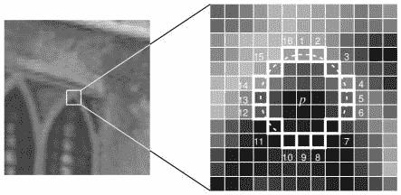
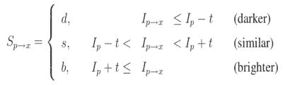
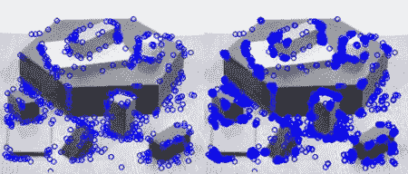

# 角点检测的 FAST 算法

## 目标

在这一章当中，

- 我们将了解 FAST 算法的基础知识
- 我们将使用 OpenCV 中的 FAST 算法找出角点。

## 理论

我们看到了几个特征点检测器，其中很多都非常好。但从实时处理的角度来看，它们还不够快。一个最好的例子是 SLAM（Simultaneous Localization and Mapping，同时定位和地图构建）移动机器人，它们的计算能力十分有限。

为解决这一问题，Edward Rosten 和 Tom Drummond 在他们 2006 年（后来在 2010 年修订）的论文“Machine learning for high-speed corner detection”中提出了 FAST（Features from Accelerated Segment Test）算法。该算法的基本概要如下。有关详细信息，请参阅原始论文（所有图像均来自原始论文）。

### 使用 FAST 进行特征检测

1. 在图像中选择要待标识的像素$$p $$。让它的强度为$$I_p$$。

2. 选择适当的阈值$$t$$。

3. 考虑被测像素周围的 16 个像素的圆圈。 （见下图）

   

4. 如果圆（16 个像素）中存在一组$$n$$个连续像素，它们都比$$I_p + t $$更亮，或者全部比$$I_p - t $$更暗，那么像素$$p$$就被认为是一个角点（如上图中白色虚线所示）。 $$n$$选取的值为 12。

5. 为了排除大量的非角点提出了一种高速测试方法。此方法仅检查 1,9,5 和 13 处的四个像素（先测试前 1 和 9。如果它们都比$$I_p + t $$更亮，或者全部比$$I_p - t $$更暗，则检查 5 和 13）。如果$$p $$是一个角点，那么其中至少有三个必须比$$I_p + t$$更亮或比$$I_p - t $$更暗。如果这两种情况都不是，那么$$p $$不能成为一个角点。如果$$p $$可能是一个角点，再检查圆圈中的所有像素。这种检测方法本身具有很高的性能，但存在一些缺点：

   - 当 n<12 时它不会丢弃很多候选点。
   - 像素的选择不是最佳的，因为它的效果取决于要解决的问题和角点分布。
   - 高速测试的结果被丢弃了。
   - 检测到的多个特征点彼此相邻。

前 3 点可以用机器学习方法解决。最后一点使用非最大值抑制来解决。

### 机器学习角点检测器

1. 选择一组训练图像（最好从待应用的领域中选择）

2. 在每个图像中使用 FAST 算法找出特征点。

3. 对于每个特征点，将其周围的 16 个像素存储为一个向量。对所有的图像都这样做来构建一个特征向量$$P $$。

4. 这 16 个像素中的每个像素（例如$$x$$）可以具有以下三种状态之一：

   

5. 根据这些状态，特征向量$$P $$被细分为 3 个子集，$$P_d $$，$$P_s $$，$$P_b $$。

6. 定义一个新的布尔变量$$K_p $$，如果$$p $$是一个角，则为 true，否则为 false。

7. 使用 ID3 算法（决策树分类器）查询每个子集。

8. 递归计算所有子集，直到$$K_p$$的熵为零。

9. 如此创建的决策树用于在其他图像中的 FAST 检测。

### 非最大值抑制

在相邻位置中检测到多个特征点是另一个问题。它通过使用非最大值抑制来解决。

1. 计算所有检测到的特征点的分数$$V $$。$$V$$是$$p$$和 16 个周围像素值之间的绝对差值之和。
2. 考虑两个相邻的特征点并比较它们的$$V$$值。
3. 丢弃具有较低$$V $$值的那个。

### 总结

它比其他现有的角点检测器快几倍。

但在噪音很高时不够鲁棒，取决于阈值。

## OpenCV 中的 FAST 特征点检测器

它可以像 OpenCV 中的任何其他特征点检测器一样调用。如果需要，您可以指定阈值，是否应用非最大值抑制，要使用的邻域等。

对于邻域，定义了三个标志，cv.FAST_FEATURE_DETECTOR_TYPE_5_8，cv.FAST_FEATURE_DETECTOR_TYPE_7_12 和 cv.FAST_FEATURE_DETECTOR_TYPE_9_16。下面是一个关于如何检测和绘制 FAST 特征点的简单代码。

```python
import numpy as np
import cv2 as cv
from matplotlib import pyplot as plt
img = cv.imread('simple.jpg',0)
# Initiate FAST object with default values
fast = cv.FastFeatureDetector_create()
# find and draw the keypoints
kp = fast.detect(img,None)
img2 = cv.drawKeypoints(img, kp, None, color=(255,0,0))
# Print all default params
print( "Threshold: {}".format(fast.getThreshold()) )
print( "nonmaxSuppression:{}".format(fast.getNonmaxSuppression()) )
print( "neighborhood: {}".format(fast.getType()) )
print( "Total Keypoints with nonmaxSuppression: {}".format(len(kp)) )
cv.imwrite('fast_true.png',img2)
# Disable nonmaxSuppression
fast.setNonmaxSuppression(0)
kp = fast.detect(img,None)
print( "Total Keypoints without nonmaxSuppression: {}".format(len(kp)) )
img3 = cv.drawKeypoints(img, kp, None, color=(255,0,0))
cv.imwrite('fast_false.png',img3)
```

结果如下。第一张图片使用了非最大值抑制的 FAST，而第二张没有使用：



## 其他资源

1. Edward Rosten and Tom Drummond, “Machine learning for high speed corner 
   detection” in 9th European Conference on Computer Vision, vol. 1, 2006, 
   pp. 430–443.
2. Edward Rosten, Reid Porter, and Tom Drummond, "Faster and better: a machine learning approach to
   corner detection" in IEEE Trans. Pattern Analysis and Machine Intelligence, 2010, vol 32, pp. 105-119.

## 练习
