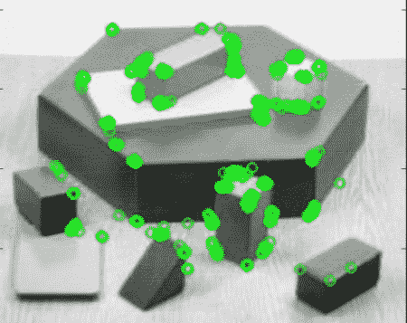

# ORB（Oriented FAST and Rotated BRIEF）

## 目标

在这一章当中，

- 我们将看到 ORB 的基础知识

## 理论

作为 OpenCV 爱好者，关于 ORB 最重要的是它来自“OpenCV Labs”。这个算法在 2011 年由 Ethan Rublee，Vincent Rabaud，Kurt Konolige 和 Gary R. Bradski 在他们的论文 **ORB: An efficient alternative to SIFT or SURF** 中提出的。如标题所述，它是一个很好的 SIFT 和 SURF 的替代，在计算成本，匹配性能，尤其是专利方面。是的，SIFT 和 SURF 已获得专利，您应该支付它们的使用费用。但是 ORB 不是!!!

ORB 基本上是 FAST 特征点检测器和 Brief 描述子的融合，并进行了许多修改以增强性能。首先，它使用 FAST 查找特征点，然后应用 Harris 角点的测量方法来查找其中的前 N 个点。它还使用金字塔来生成多尺度特征。但有一个问题是，FAST 不计算方向。那么旋转不变性呢？作者提出了以下修改。

它计算以角点为中心的图像块的强度加权质心。从该角点到质心的矢量方向给出了方向。为了改善旋转不变性，使用 x 和 y 计算矩，该 x 和 y 应该在半径为$$r $$的圆形区域中，其中$$r $$是图像块的大小。

现在来看描述子，ORB 使用 BRIEF 描述子。但我们已经看到，Brief 在图像旋转时表现不佳。因此，ORB 所做的是根据特征点的方向“引导”BRIEF。对于位于$$(x_i,y_i)$$的$$n $$二进制测试的任意特征集，定义一个$$2 \times n $$矩阵，$$S $$包含这些像素的坐标。然后使用图像块的方向，$$\theta $$，找到其旋转矩阵并旋转$$S $$以获得转向（旋转）版本$$S_ \theta $$。

ORB 将角度划分为$$2 \pi / 30 $$（12 度）的增量，并构建一个预先计算的 BRIEF 的查找表。只要特征点方向$$\theta $$在视图之间保持一致，就会使用正确的点集$$S_ \theta $$来计算其描述符。

BRIEF 具有一个重要特性，即每个位特征具有较大的方差，平均值接近 0.5。但是一旦它沿着特征点方向定向，它就会失去这个特性并变得更加分散。高的方差使得特征更易于分辨，因为它对输入有不同的响应。另一个理想的特性是使测试不相关，因为每次测试都会对结果产生影响。为了解决所有这些问题，ORB 在所有可能的二进制测试中运行贪婪搜索，以找到具有高方差和意味着接近 0.5 的那些，以及不相关的。结果称为 **rBRIEF** 。

对于描述子匹配，使用对传统 LSH 进行改善后的多探针 LSH。该论文称 ORB 比 SURF 和 SIFT 快得多，并且 ORB 描述子比 SURF 效果更好。 ORB 是用于全景拼接等的低功率设备的不错选择。

## OpenCV 中的 ORB

像往常一样，我们必须使用函数 **[cv.ORB()](https://docs.opencv.org/4.0.0/db/d95/classcv_1_1ORB.html)** 或使用 feature2d 通用接口创建 ORB 对象。它有许多可选参数。最有用的是 nFeatures，表示要保留的最大要素数量（默认为 500），scoreType 表示对特征点进行排序使用 Harris 得分或 FAST 得分（默认情况下为 Harris 得分）等。另一个参数 WTA_K 决定生成一个 oriented BRIEF 描述子的所用的像素点数目。默认情况下它是 2，即一次选择两个点。在这种情况下进行匹配，使用 NORM_HAMMING 距离。如果 WTA_K 为 3 或 4，则需要 3 或 4 个点来产生 BRIEF 描述子，匹配距离由 NORM_HAMMING2 定义。

下面是一个简单的代码，展示了 ORB 的用法。

```python
import numpy as np
import cv2 as cv
from matplotlib import pyplot as plt
img = cv.imread('simple.jpg',0)
# Initiate ORB detector
orb = cv.ORB_create()
# find the keypoints with ORB
kp = orb.detect(img,None)
# compute the descriptors with ORB
kp, des = orb.compute(img, kp)
# draw only keypoints location,not size and orientation
img2 = cv.drawKeypoints(img, kp, None, color=(0,255,0), flags=0)
plt.imshow(img2), plt.show()
```

看下面的结果：



ORB 特征点的匹配，我们将在另一章中做。

## 其他资源

1. Ethan Rublee, Vincent Rabaud, Kurt Konolige, Gary R. Bradski: ORB: An 
   efficient alternative to SIFT or SURF. ICCV 2011: 2564-2571.

## 练习
