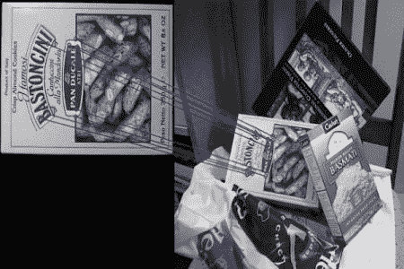
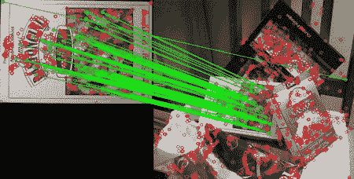

# 特征匹配

## 目标

在这一章当中

- 我们将看到如何将一个图像中的特征点与其他图像进行匹配。
- 我们将在 OpenCV 中使用蛮力（Brute-Force）匹配和 FLANN 匹配

## 蛮力匹配的基础知识

蛮力匹配器很简单。它采用第一组中的一个特征点描述子，并使用一些距离计算与第二组中的所有其他特征点匹配。并返回距离最近的一个特征点。

对于 BF 匹配器，首先我们必须使用 **[cv.BFMatcher()](https://docs.opencv.org/4.0.0/d3/da1/classcv_1_1BFMatcher.html)** 创建 BFMatcher 对象。它需要两个可选的参数。第一个是 normType。它指定要使用的距离测量方法。默认情况下，它是 [cv.NORM_L2](https://docs.opencv.org/4.0.0/d2/de8/group__core__array.html#ggad12cefbcb5291cf958a85b4b67b6149fa7bacbe84d400336a8f26297d8e80e3a2) 。它很适合于 SIFT 和 SURF 等（ [cv.NORM_L1](https://docs.opencv.org/4.0.0/d2/de8/group__core__array.html#ggad12cefbcb5291cf958a85b4b67b6149fab55c78ff204a979026c026ea19de65c9) 也可以）。对于基于二进制字符串的描述子，如 ORB，BRIEF，BRISK 等，应使用 [cv.NORM_HAMMING](https://docs.opencv.org/4.0.0/d2/de8/group__core__array.html#ggad12cefbcb5291cf958a85b4b67b6149fa4b063afd04aebb8dd07085a1207da727) ，它使用汉明距离作为度量。如果 ORB 使用 WTA_K == 3 或 4，则应使用 [cv.NORM_HAMMING2](https://docs.opencv.org/4.0.0/d2/de8/group__core__array.html#ggad12cefbcb5291cf958a85b4b67b6149fa7fab9cda83e79380cd273c49de8e3231) 。

第二个参数是布尔变量 crossCheck，默认为 false。如果为 True，则 Matcher 仅返回具有值(i,j)的匹配,使得集合 A 中的第 i 个描述子具有集合 B 中的第 j 个描述子作为最佳匹配，反之亦然。也就是说，两组中的两个特征点应该相互匹配。它提供了一致的结果，是 D.Lowe 在 SIFT 论文中提出的比率测试的一个很好的替代方案。

一旦创建，两个重要的方法是 _BFMatcher.match()_ 和 _BFMatcher.knnMatch()_。第一个返回最佳匹配。第二种方法返回 k 个最佳匹配，其中 k 由用户指定。当我们需要做更多的工作时，它可能会有用。

就像我们使用 [cv.drawKeypoints()](https://docs.opencv.org/4.0.0/d4/d5d/group__features2d__draw.html#gad8f463ccaf0dc6f61083abd8717c261a)绘制特征点一样， **[cv.drawMatches()](https://docs.opencv.org/4.0.0/d4/d5d/group__features2d__draw.html#gad8f463ccaf0dc6f61083abd8717c261a)** 帮助我们绘制匹配。它水平堆叠两个图像，并从第一个图像到第二个图像绘制线条，显示最佳匹配。还有 **cv.drawMatchesKnn** ，它绘制了所有 k 个最佳匹配。如果 k = 2，它将为每个关键点绘制两条匹配线。因此，如果我们想要有选择地绘制它，我们必须传递一个掩模。

让我们看一下 SURF 和 ORB 的两个例子（两者都使用不同的距离测量）。

### 对 ORB 描述子使用蛮力匹配

在这里，我们将看到一个关于如何匹配两个图像之间的特征的简单示例。在这种情况下，我有一个 queryImage 和一个 trainImage。我们将尝试使用特征匹配在 trainImage 中查找 queryImage。 （图片为/samples/c/box.png 和/samples/c/box_in_scene.png）

我们使用 ORB 描述符来匹配功能。所以让我们从加载图像，查找描述子等开始。

```python
import numpy as np
import cv2 as cv
import matplotlib.pyplot as plt
img1 = cv.imread('box.png',0)          # queryImage
img2 = cv.imread('box_in_scene.png',0) # trainImage
# Initiate ORB detector
orb = cv.ORB_create()
# find the keypoints and descriptors with ORB
kp1, des1 = orb.detectAndCompute(img1,None)
kp2, des2 = orb.detectAndCompute(img2,None)
```

接下来，我们使用 [cv.NORM_HAMMING](../../d2/de8/group__core__array.html#ggad12cefbcb5291cf958a85b4b67b6149fa4b063afd04aebb8dd07085a1207da727) （因为我们使用的是 ORB）创建一个 BFMatcher 对象并且启用了 crossCheck 以获得更好的结果。然后我们使用 Matcher.match()方法在两个图像中获得最佳匹配。我们按照距离的升序对它们进行排序，以便最佳匹配（距离最小）出现在前面。然后我们只画出前 10 个匹配（仅为了能见度，你可以随意增加匹配的个数）。

```python
# create BFMatcher object
bf = cv.BFMatcher(cv.NORM_HAMMING, crossCheck=True)
# Match descriptors.
matches = bf.match(des1,des2)
# Sort them in the order of their distance.
matches = sorted(matches, key = lambda x:x.distance)
# Draw first 10 matches.
img3 = cv.drawMatches(img1,kp1,img2,kp2,matches[:10], None, flags=2)
plt.imshow(img3),plt.show()
```

以下是我得到的结果：



### 这个匹配器对象是什么？

matches = bf.match(des1,des2)的结果是 DMatch 对象的列表。此 DMatch 对象具有以下属性：

- DMatch.distance  - 描述子之间的距离。越低越好。
- DMatch.trainIdx  - 目标图像中描述子的索引
- DMatch.queryIdx  - 查询图像中描述子的索引
- DMatch.imgIdx  - 目标图像的索引。

###  **对 SIFT  描述符进行蛮力匹配和比率测试**

这一次，我们将使用 BFMatcher.knnMatch()来获得最佳匹配。在这个例子中，我们将采用 k = 2，以便我们可以在使用 D.Lowe 论文中的比率测试。

```python
import numpy as np
import cv2 as cv
from matplotlib import pyplot as plt
img1 = cv.imread('box.png',0)          # queryImage
img2 = cv.imread('box_in_scene.png',0) # trainImage
# Initiate SIFT detector
sift = cv.SIFT()
# find the keypoints and descriptors with SIFT
kp1, des1 = sift.detectAndCompute(img1,None)
kp2, des2 = sift.detectAndCompute(img2,None)
# BFMatcher with default params
bf = cv.BFMatcher()
matches = bf.knnMatch(des1,des2, k=2)
# Apply ratio test
good = []
for m,n in matches:
    if m.distance < 0.75*n.distance:
        good.append([m])
# cv.drawMatchesKnn expects list of lists as matches.
img3 = cv.drawMatchesKnn(img1,kp1,img2,kp2,good,flags=2)
plt.imshow(img3),plt.show()
```

结果如下：


## 基于 FLANN 的匹配器

FLANN 代表快速最近邻搜索包（Fast Library for Approximate Nearest Neighbors）。它包含一系列算法，这些算法针对大型数据集中的快速最近邻搜索和高维特征进行了优化。对于大型数据集，它比 BFMatcher 工作得更快。我们将看到基于 FLANN 的匹配器的第二个示例。

对于基于 FLANN 的匹配器，我们需要传递两个字典作为参数，用来指定要使用的算法及其相关参数等。首先是 IndexParams。对于各种算法的信息在 FLANN 文档中进行了解释。总而言之，对于 SIFT 和 SURF 等算法，您可以传递以下参数：

```python
index_params = dict(algorithm = FLANN_INDEX_KDTREE, trees = 5)
```

使用 ORB 时，您可以传递以下参数。注释掉的参数是文献中推荐使用的，但在某些情况下不会提供所需的结果。其他值可能更好：

```python
index_params= dict(algorithm = FLANN_INDEX_LSH,
                   table_number = 6, # 12
                   key_size = 12,     # 20
                   multi_probe_level = 1) #2
```

第二个字典是 SearchParams。它指定应递归遍历索引中的树的次数。值越高，精度越高，但也需要更多时间。如果要更改该值，请传入参数：search_params = dict（checks = 100）。

有了这些信息，我们就可以开始了。

```python
import numpy as np
import cv2 as cv
from matplotlib import pyplot as plt
img1 = cv.imread('box.png',0)          # queryImage
img2 = cv.imread('box_in_scene.png',0) # trainImage
# Initiate SIFT detector
sift = cv.SIFT()
# find the keypoints and descriptors with SIFT
kp1, des1 = sift.detectAndCompute(img1,None)
kp2, des2 = sift.detectAndCompute(img2,None)
# FLANN parameters
FLANN_INDEX_KDTREE = 1
index_params = dict(algorithm = FLANN_INDEX_KDTREE, trees = 5)
search_params = dict(checks=50)   # or pass empty dictionary
flann = cv.FlannBasedMatcher(index_params,search_params)
matches = flann.knnMatch(des1,des2,k=2)
# Need to draw only good matches, so create a mask
matchesMask = [[0,0] for i in xrange(len(matches))]
# ratio test as per Lowe's paper
for i,(m,n) in enumerate(matches):
    if m.distance < 0.7*n.distance:
        matchesMask[i]=[1,0]
draw_params = dict(matchColor = (0,255,0),
                   singlePointColor = (255,0,0),
                   matchesMask = matchesMask,
                   flags = 0)
img3 = cv.drawMatchesKnn(img1,kp1,img2,kp2,matches,None,**draw_params)
plt.imshow(img3,),plt.show()
```

结果如下：



## 其他资源

## 练习
