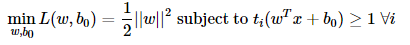
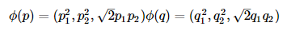
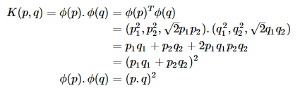
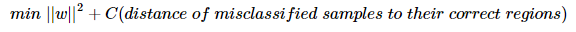
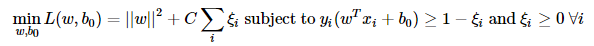

# 理解 SVM

## 目标
在本章
* 我们将对 SVM 有个直观理解

## 原理
### 线性可分离数据
考虑下面的图像有两种类型的数据，红色和蓝色。在 kNN 中，对于一个测试数据，我们通常要计算它与所有训练样本的距离，并选择最短距离的那个。计算与所有样本的距离花费了大量时间，而且存储所有的训练样本要花费大量的内存。但是，对于图片中所给出的数据，我们真的需要这么多吗？

  
<b>图像</b>

换个思路。我们可以找到一条直线 **f(x)=ax1 + bx2 + c** 将数据分成两个区域。当我们得到一个新的测试数据 ***X*** 时，只需用 **f(x)** 代替它。如果 **f(*X*) > 0** ，则属于蓝色组，否则属于红色组。我们可以将此直线称为**决策边界**。这非常简单，并且用的内存很少。像这种能够用一条直线（或更高维度的超平面）分割成两部分的数据被称为**线性可分离的**。

在上图中，你可以看到很多这样的直线。我们将选哪一条？非常直观地说，该直线应该尽可能远离所有点。为什么呢？因为输入数据中可能存在噪声数据。这些噪声数据不应影响分类准确性。因此，选择最远的直线将提供更强的抗噪声能力。因此，SVM 所做的是找到与训练样本具有最大最小距离的直线（或超平面）。请参见下图中穿过中心的粗线。

  
<b>图像</b>

因此，为了找到决策边界，你需要训练数据。你需要训练所有数据吗？ 不。仅仅那些接近对方的数据就够了。在我们的图像中，它们是一个蓝色填充圆和两个红色填充正方形。我们可以称它们为**支持向量**，通过它们的线称为**支持平面**。它们足以找到我们的决策边界。我们无需为所有数据的量太大而担心。它有助于减少数据。

发生了什么事呢？首先，有两个超平面被发现最能代表数据。例如，蓝色数据由 **wTx + b0 > 1** 表示，而红色数据由 **wTx + b0 < -1** 表示，其中 **w** 是权重向量（ **w = [w1,w2,...,wn]** ）， **x** 是特征向量（ **x = [x1,x2,...,xn]** ）， **b0** 是偏差。权重向量决定决策边界的方向，而偏差点决定其位置。现在，决策边界被定义为这些超平面的中间，因此表示为 **wTx + b0 = 0** 。从支持向量到决策边界的最小距离由 **distancesupport vectors = 1/||w||** 给出。间距是这个距离的两倍，我们需要最大化这个间距。即我们需要最小化一个新函数 **L(w,b0)** ，其中一些约束可以表示如下：

  

其中 ti 是每个类的标签， **ti ∈ [-1,1]** 。

### 非线性可分离数据
考虑到一些数据并不能用直线分成两部分。例如，一维数据，其中'X'在-3 和+3，'O'在-1 和+1。显然，它不是线性可分的。但是有一些方法可以解决这类问题。 如果我们可以用函数 **f(x) = x2** 映射这个数据集，我们得到'X'为 9，'O'为 1，它们是线性可分的。

另外，我们可以将这个一维数据转换为二维数据。我们可以使用 **f(x) = (x, x2)** 函数来映射这些数据。然后'X'变为(-3,9)和(3,9)，而'O'变为(-1,1)和(1,1)。这也是线性可分的。简而言之，低维空间中的非线性可分数据在高维空间中变得线性可分离的可能性更大。

通常，这种方法是可行的，将 d 维空间中的点映射到某个 D 维空间 **(*D* > d)** 以检查线性可分离性的可能性。有一个想法有助于通过在低维输入（特征）空间中执行计算来计算高维（核）空间中的点积。我们可以通过以下示例来说明。

考虑二维空间中的两个点， **p = (p1, p2)** 和 **q = (q1, q2)** 。设 ***Φ*** 是一个映射函数，它将二维的点映射到三维空间，如下所示：

  

让我们定义一个核函数 ***K*(*p*,*q*)** ，它在两点之间做一个点积，如下所示：

  

这意味着，在二维空间中使用平方点积可以实现三维空间中的点积。这可以应用于更高维度的空间。因此，我们可以从较低维度本身计算更高维度的特征。一旦我们映射它们，我们就会获得一个更高维的空间。

除了所有这些概念之外，还存在分类错误的问题。因此，仅仅找到具有最大间距的决策边界是不够的。我们还需要考虑分类错误的问题。有时，可能会找到间距较小的决策边界，但分类错误减少。无论如何，我们需要修改我们的模型，使其找到具有最大间距的决策边界，但分类错误较少。最小化标准修改为：

  

下图显示了这个概念。对于训练数据的每个样本，定义新参数 ***ξ*i** 。它是从相应的训练样本到正确决策区域的距离。对于那些没有被错误分类的数据，它们会落在相应的支持平面上，因此它们的距离为零。

  
<b>图像</b>

所以新的优化问题是：

  

如何选择参数 C？很明显，这个问题的答案取决于训练数据的分布方式。虽然没有一般性答案，但考虑以下规则很有用：
* 较大的 C 值给出的解决方案具有较少的错误分类，但间距较小。当错误分类的代价高昂时，可以考虑此方案。因为优化的目标是最小化参数，所以较少的分类错误也是被允许的。
* 小的 C 值给出的解决方案具有更大的间距和更多的分类错误。在这种情况下，最小化并不会太关心求和项，因此它更侧重于寻找具有大间距的超平面。

## 额外资源
1. [NPTEL 关于统计模式识别的说明，第 25-29 章](http://www.nptel.ac.in/courses/106108057/26)

## 练习
