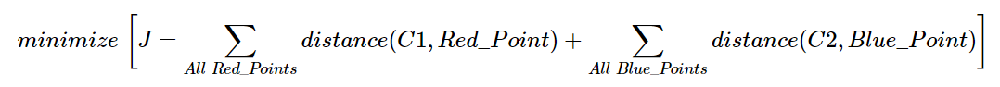

# 理解 K-Means 聚类
## 目标
在本章中，我们将了解 K-Means 聚类的概念，以及它是如何工作的，等等。

## 原理
我们将用一个常用的例子来解释原理。

### T 恤大小问题
举个例子，有一家公司将向市场推出一种新型 T 恤。显然，他们必须制造不同尺寸的衣服，以满足各种身材的人。为此，公司收集了一份人的身高和体重的数据，并将其绘制成图表，如下所示：

  
<b>图像</b>

公司不能制作所有尺寸的 T 恤。相反，他们将人们划分为小巧、中等和高大，并且仅制造这 3 种尺寸的衣服，以满足所有人的需求。将人群分为 3 组这种事情可以用 K-Means 聚类算法来完成，并且算法能够给我们找出最合适的 3 个尺寸，让所有人满意。如果不行，公司可以将人们分成更多的组，可能是 5 组，或者其它。查看下图：

  
<b>图像</b>

### 如何工作的？
该算法是一个迭代过程，我们将在图像的帮助下逐步解释它。

考虑如下的一组数据（你可以将其视为 T 恤问题）。我们需要将这些数据分成两组。

  
<b>图像</b>

**步骤一：** 算法随机选择两个中心点 ***C*1** 和 ***C*2**（有时，任何两个数据都可以被选为中心点）。

**步骤二：** 计算从每个点到两个中心点的距离。如果测试数据更接近 ***C*1**，则该数据标记为'0'。如果它更接近 ***C*2**，则标记为'1'（如果有更多中心点，标记为'2'，'3'等）。

在这个例子中，我们用红色标记所有的'0'，用蓝色标记所有的'1'。在上述操作之后，我们得到了下图：

  
<b>图像</b>

**步骤三：** 接下来，我们分别计算所有蓝点和红点的平均值，这将是我们的新中心点。将 ***C*1** 和 ***C*2** 移过去。（要记住，这个图像所显示的并不是真正的值，也不是真正的规模，它仅用于演示）。

再来一次，使用新的中心点执行步骤二，并将数据标记为'0'和'1'。

然后我们得到了如下结果：

  
<b>图像</b>

现在，迭代 **步骤二** 和 **步骤三**，直到两个中心点收敛到固定点。\*( 或者可能根据我们所给的条件停止，如最大迭代次数，或达到特定的准去率等。)\* **这些点使得测试数据与其对应的中心点之间的距离之和最小。** 或者简单地说，***C1↔红色点*** 和 ***C2↔蓝色点*** 之间的距离之和最小。

  

最终结果大概如下所示：

  
<b>图像</b>

这只是对 K-Means 聚类的直观理解。有关更多详细信息和数学解释，请阅读任何规范的机器学习教科书或阅读额外资源中的链接。这只是 K-Means 聚类的顶层。这个算法有很多修改，如如何选择初始中心点，如何加速迭代过程等。

## 额外资源
1. [机器学习课程](https://www.coursera.org/course/ml)，Andrew Ng 教授的视频讲座（部分图片取自于此）

## 练习
