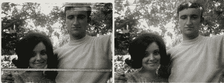
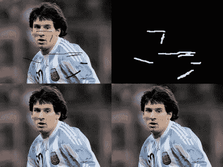

# 图像修复

## 目标

在这一章当中，

*   我们将学习如何通过一种称为修复的方法去除旧照片中的小噪音，笔画等
*   我们将在 OpenCV 中看到修复功能。

## 基本

大多数人会在家里放一些旧的退化照片，上面有一些黑点，一些笔画等。你有没有想过恢复它？我们不能简单地在绘画工具中擦除它们，因为它将简单地用白色结构替换黑色结构，这是没有用的。在这些情况下，使用称为图像修复的技术。基本思路很简单：用相邻像素替换那些坏标记，使其看起来像邻域。考虑下面显示的图像（取自[维基百科](http://en.wikipedia.org/wiki/Inpainting)）：



为此目的设计了几种算法，OpenCV 提供了两种算法。两者都可以通过相同的功能访问， **[cv.inpaint（）](../../d1/d0d/group__photo.html#gaedd30dfa0214fec4c88138b51d678085 "Restores the selected region in an image using the region neighborhood. ")**

第一种算法基于 2004 年由 Alexandru Telea 撰写的**“基于快速行进方法的图像修复技术”**。它基于快速行进方法。考虑图像中要修复的区域。算法从该区域的边界开始，然后进入区域内，逐渐填充边界中的所有内容。它需要在邻域像素周围的一个小邻域进行修复。该像素由邻域中所有已知像素的归一化加权和代替。选择权重是一个重要的问题。对于靠近该点的那些像素，靠近边界的法线和位于边界轮廓上的那些像素，给予更多的权重。一旦像素被修复，它将使用快速行进方法移动到下一个最近的像素。 FMM 确保首先修复已知像素附近的像素，这样它就像手动启发式操作一样工作。使用标志 [cv.INPAINT_TELEA](../../d1/d0d/group__photo.html#ggabfc4ba1d1fb873f2b56d34032f86c1d4a892824c38e258feb5e72f308a358d52e) 启用此算法。

第二种算法基于 Bertalmio，Marcelo，Andrea L. Bertozzi 和 Guillermo Sapiro 在 2001 年的论文**“Navier-Stokes，流体动力学和图像和视频修补”**。该算法基于流体动力学和利用偏微分方程。基本原则是 heurisitic。它首先沿着已知区域的边缘行进到未知区域（因为边缘是连续的）。它继续等照片（连接具有相同强度的点的线，就像轮廓连接具有相同高度的点一样），同时在修复区域的边界处匹配渐变矢量。为此，使用来自流体动力学的一些方法。获得颜色后，填充颜色以减少该区域的最小差异。使用标志 [cv.INPAINT_NS](../../d1/d0d/group__photo.html#ggabfc4ba1d1fb873f2b56d34032f86c1d4a05e763003a805e6c11c673a9f4ba7d07) 启用此算法。

## 代码

我们需要创建一个与输入图像大小相同的掩码，其中非零像素对应于要修复的区域。其他一切都很简单。我的图像因一些黑色笔画而降级（我手动添加）。我用 Paint 工具创建了相应的笔触。

```python
import numpy as np
import cv2 as cv

img = cv.imread('messi_2.jpg')
mask = cv.imread('mask2.png',0)
dst = cv.inpaint(img,mask,3,cv.INPAINT_TELEA)

cv.imshow('dst',dst)
cv.waitKey(0)
cv.destroyAllWindows()
```

请参阅下面的结果。第一张图像显示降级输入。第二个图像是面具。第三个图像是第一个算法的结果，最后一个图像是第二个算法的结果。



## 其他资源

1.  Bertalmio，Marcelo，Andrea L. Bertozzi 和 Guillermo Sapiro。 “Navier-stokes，流体动力学，图像和视频修复。”在计算机视觉和模式识别，2001 年.CVPR 2001\. 2001 年 IEEE 计算机学会会议论文集，第一卷。 1，pp.I-355。 IEEE，2001。
2.  Telea，Alexandru。 “基于快速行进方法的图像修复技术。” Journal of graphics tools 9.1（2004）：23-34。

## 演习

1.  OpenCV 附带了一个关于 inpainting 的示例/ sample / python / inpaint.py 的交互式示例，试一试。
2.  几个月前，我观看了一个关于 [Content-Aware Fill](http://www.youtube.com/watch?v=ZtoUiplKa2A) 的视频，这是 Adobe Photoshop 中使用的一种先进的修复技术。在进一步搜索时，我能够发现 GIMP 中已经存在相同的技术，具有不同的名称，“Resynthesizer”（您需要安装单独的插件）。我相信你会喜欢这项技术。