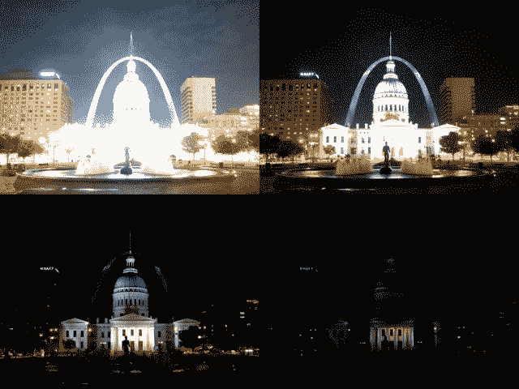
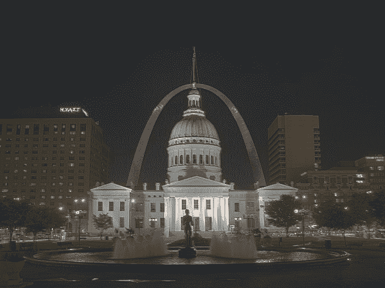
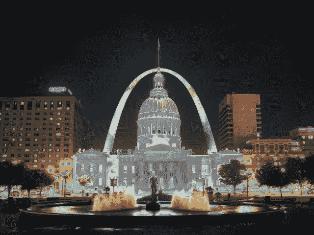
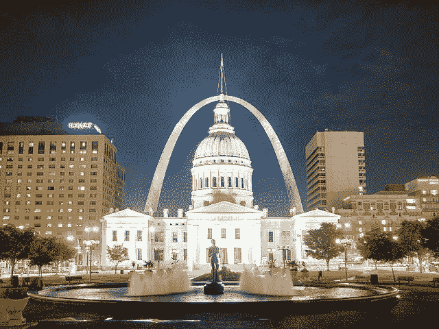
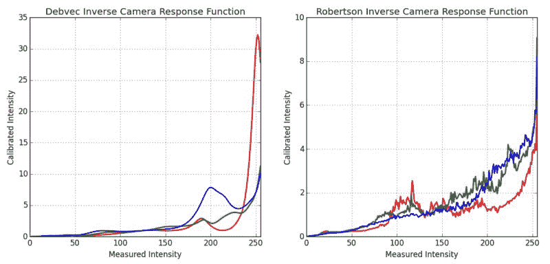

# 高动态范围（HDR）

## 目标

在本章中，我们将

*   了解如何从曝光序列生成和显示 HDR 图像。
*   使用曝光融合来合并曝光序列。

## 理论

高动态范围成像（HDRI 或 HDR）是一种用于成像和摄影的技术，可以再现比标准数字成像或照相技术更大的动态光度范围。虽然人眼可以适应各种光线条件，但大多数成像设备每通道使用 8 位，因此我们仅限于 256 级。当我们拍摄现实世界场景的照片时，明亮区域可能会过度曝光，而暗区域可能曝光不足，因此我们无法使用单次曝光捕捉所有细节。 HDR 成像适用于每通道使用 8 位以上（通常为 32 位浮点值）的图像，从而允许更宽的动态范围。

获得 HDR 图像的方法有很多种，但最常见的方法是使用不同曝光值拍摄的场景照片。要结合这些曝光，了解相机的响应函数是有用的，并且有估算它的算法。合并 HDR 图像后，必须将其转换回 8 位以在通常的显示器上查看。此过程称为色调映射。当场景或相机的物体在镜头之间移动时会出现额外的复杂性，因为应该注册和对齐具有不同曝光的图像。

在本教程中，我们展示了 2 种算法（Debevec，Robertson），用于从曝光序列生成和显示 HDR 图像，并演示了一种称为曝光融合（Mertens）的替代方法，该方法产生低动态范围图像，不需要曝光时间数据。此外，我们估计相机响应函数（CRF），这对许多计算机视觉算法具有重要价值。 HDR 流水线的每个步骤都可以使用不同的算法和参数来实现，因此请查看参考手册以查看所有步骤。

## 曝光顺序 HDR

在本教程中，我们将查看以下场景，其中我们有 4 个曝光图像，曝光时间为：15,2.5,1 / 4 和 1/30 秒。 （您可以从[维基百科](https://en.wikipedia.org/wiki/High-dynamic-range_imaging)下载图像）



### 1.将曝光图像加载到列表中

第一阶段只是将所有图像加载到列表中。此外，我们还需要常规 HDR 算法的曝光时间。注意数据类型，因为图像应该是 1 通道或 3 通道 8 位（np.uint8），曝光时间需要为 float32，并且以秒为单位。

```python
import cv2 as cv
import numpy as np

# Loading exposure images into a list
img_fn = ["img0.jpg", "img1.jpg", "img2.jpg", "img3.jpg"]
img_list = [cv.imread(fn) for fn in img_fn]
exposure_times = np.array([15.0, 2.5, 0.25, 0.0333], dtype=np.float32)
```

### 2.将曝光合并到 HDR 图像中

在这个阶段，我们将曝光序列合并为一个 HDR 图像，显示我们在 OpenCV 中有两种可能性。第一种方法是 Debevec，第二种方法是 Robertson。请注意，HDR 图像的类型为 float32，而不是 uint8，因为它包含所有曝光图像的完整动态范围。

```python
# Merge exposures to HDR 
imagemerge_debevec = cv.createMergeDebevec()
hdr_debevec = merge_debevec.process(img_list, times=exposure_times.copy())
merge_robertson = cv.createMergeRobertson()
hdr_robertson = merge_robertson.process(img_list, times=exposure_times.copy())
```

### 3\. Tonemap HDR 图像

我们将 32 位浮点 HDR 数据映射到范围[0..1]。实际上，在某些情况下，值可以大于 1 或小于 0，因此请注意我们稍后将不得不剪切数据以避免溢出。

```python
# Tonemap HDR image
tonemap1 = cv.createTonemapDurand(gamma=2.2)
res_debevec = tonemap1.process(hdr_debevec.copy())
tonemap2 = cv.createTonemapDurand(gamma=1.3)
res_robertson = tonemap2.process(hdr_robertson.copy())
```

### 4.使用 Mertens 融合合并曝光

在这里，我们展示了一种合并曝光图像的替代算法，我们不需要曝光时间。我们也不需要使用任何色调图算法，因为 Mertens 算法已经给出了[0..1]范围内的结果。

```python
# Exposure fusion using Mertens
merge_mertens = cv.createMergeMertens()
res_mertens = merge_mertens.process(img_list)
```

### 5.转换为 8 位并保存

为了保存或显示结果，我们需要将数据转换为[0..255]范围内的 8 位整数。

```python
# Convert datatype to 8-bit and save
res_debevec_8bit = np.clip(res_debevec*255, 0, 255).astype('uint8')
res_robertson_8bit = np.clip(res_robertson*255, 0, 255).astype('uint8')
res_mertens_8bit = np.clip(res_mertens*255, 0, 255).astype('uint8')

cv.imwrite("ldr_debevec.jpg", res_debevec_8bit)
cv.imwrite("ldr_robertson.jpg", res_robertson_8bit)
cv.imwrite("fusion_mertens.jpg", res_mertens_8bit)
```

## 结果

您可以看到不同的结果，但考虑到每个算法都有额外的额外参数，您应该适合获得所需的结果。最佳做法是尝试不同的方法，看看哪种方法最适合您的场景。

### 德普外阁(Debevec)：



### 罗伯逊(Robertson)：



### 梅特内斯·福森(Mertenes Fusion)：



## 估计相机响应功能

相机响应功能（CRF）为我们提供了场景辐射与测量强度值之间的连接。 CRF 在一些计算机视觉算法中非常重要，包括 HDR 算法。在这里，我们估计逆相机响应函数并将其用于 HDR 合并。

```python
# Estimate camera response function (CRF)
cal_debevec = cv.createCalibrateDebevec()
crf_debevec = cal_debevec.process(img_list, times=exposure_times)

hdr_debevec = merge_debevec.process(img_list, 	times=exposure_times.copy(),response=crf_debevec.copy())

cal_robertson = cv.createCalibrateRobertson()
crf_robertson = cal_robertson.process(img_list, times=exposure_times)

hdr_robertson = merge_robertson.process(img_list, times=exposure_times.copy(), response=crf_robertson.copy())
```

相机响应函数由每个颜色通道的 256 长度矢量表示。对于此序列，我们得到以下估计：



## 其他资源

1.  Paul E Debevec 和 Jitendra Malik。从照片中恢复高动态范围辐射图。在 ACM SIGGRAPH 2008 课程中，第 31 页.ACM，2008。 [[44]](../../d0/de3/citelist.html#CITEREF_DM97)
2.  Mark A Robertson，Sean Borman 和 Robert L Stevenson。通过多次曝光改善动态范围。在 Image Processing，1999。ICIP 99.会议录。 1999 年国际会议，第 3 卷，第 159-163 页。 IEEE，1999。 [[166]](../../d0/de3/citelist.html#CITEREF_RB99)
3.  Tom Mertens，Jan Kautz 和 Frank Van Reeth。曝光融合。在计算机图形和应用程序，2007 年.PG'07。第 15 届太平洋会议，第 382-390 页。 IEEE，2007。 [[136]](../../d0/de3/citelist.html#CITEREF_MK07)
4.  来自 [Wikipedia-HDR](https://en.wikipedia.org/wiki/High-dynamic-range_imaging) 的图片

## 演习

1.  尝试所有色调图算法： [cv :: TonemapDrago](../../da/d53/classcv_1_1TonemapDrago.html "Adaptive logarithmic mapping is a fast global tonemapping algorithm that scales the image in logarith...") ， [cv :: TonemapDurand](../../da/d3d/classcv_1_1TonemapDurand.html "This algorithm decomposes image into two layers: base layer and detail layer using bilateral filter a...") ， [cv :: TonemapMantiuk](../../de/d76/classcv_1_1TonemapMantiuk.html "This algorithm transforms image to contrast using gradients on all levels of gaussian pyramid...") 和 [cv :: TonemapReinhard](../../d0/dec/classcv_1_1TonemapReinhard.html "This is a global tonemapping operator that models human visual system. ")
2.  尝试更改 HDR 校准和色调映射方法中的参数。